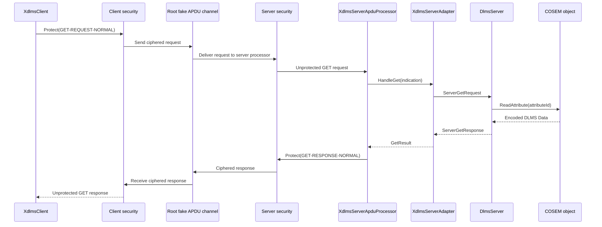

# Ciphered GET Integration Plan

## 1. Scope

This document defines the root integration boundary for a ciphered
`GET-REQUEST-NORMAL` round trip across the existing security, xDLMS, and server
service layers.

In scope:

- build a protected normal GET request through `dlms-xdlms`;
- unprotect the request through `dlms-security` in the server APDU processor;
- dispatch the decoded GET indication through `dlms-server`;
- read encoded DLMS `Data` bytes from a `dlms-cosem` object;
- protect the normal GET response through `dlms-security`;
- unprotect and decode the response through the xDLMS client path.

Out of scope:

- association authentication negotiation;
- LLS and HLS challenge-response;
- persistent key storage;
- live meter transport I/O;
- block transfer;
- key agreement or key wrapping.

## 2. Requirements

1. The root integration test shall use only public headers from participating
   component directories in the root repository.
2. The same Suite 0 global unicast encryption and authentication keys shall be
   installed for client and server processors.
3. Client and server security contexts shall use opposite local and remote
   system titles.
4. Invocation counters shall start from known values and advance through the
   protected request and response.
5. The channel shall carry ciphered xDLMS APDUs, not plain GET APDU bytes.
6. The server handler shall receive a decoded normal GET indication.
7. The client shall receive decoded response data and return `XdlmsStatus::Ok`.
8. A full root build and test run shall remain green.

## 3. API Boundary

The integration path uses these public contracts:

```text
dlms-security
  SecurityContext, InMemoryKeyStore, InMemoryInvocationCounterStore, and
  CipheredApduProcessor protect and unprotect xDLMS APDUs.

dlms-xdlms
  XdlmsClient protects requests and unprotects responses when constructed with
  CipheredApduProcessor.
  XdlmsServerApduProcessor unprotects requests and protects responses when
  constructed with CipheredApduProcessor.

dlms-server
  XdlmsServerAdapter maps GetIndication to DlmsServer GET handling.

dlms-cosem
  LogicalDevice locates the target object and returns encoded attribute data.
```

No production code is introduced in the root repository. The root test proves
that the already public layer contracts compose.

## 4. Architecture

```mermaid
flowchart LR
  Client["XdlmsClient"]
  ClientSec["client CipheredApduProcessor"]
  Channel["root fake APDU channel"]
  ServerProc["XdlmsServerApduProcessor"]
  ServerSec["server CipheredApduProcessor"]
  Adapter["XdlmsServerAdapter"]
  Server["DlmsServer"]
  Device["LogicalDevice"]
  Object["Test COSEM object"]

  Client --> ClientSec
  ClientSec --> Channel
  Channel --> ServerSec
  ServerSec --> ServerProc
  ServerProc --> Adapter
  Adapter --> Server
  Server --> Device
  Device --> Object
  Object --> Device
  Device --> Server
  Server --> Adapter
  Adapter --> ServerProc
  ServerProc --> ServerSec
  ServerSec --> Channel
  Channel --> ClientSec
  ClientSec --> Client
```



## 5. Success Flow



## 6. Test Plan

Add a focused root integration case:

- `CipheredGetRoundTripProtectsClientAndServerApdus`
  - installs Suite 0 encryption and authentication keys;
  - creates client and server security contexts with mirrored system titles;
  - opens an association over a fake APDU channel;
  - routes the protected GET request through `XdlmsServerApduProcessor`;
  - verifies the wire request and response are ciphered APDUs;
  - verifies the COSEM object is read once;
  - verifies the xDLMS client returns decoded response data.

### Verification Commands

```text
cmake -S . -B build-mingw64
cmake --build build-mingw64
ctest --test-dir build-mingw64 --output-on-failure
```

## 7. Phase Exit Criteria

The documentation phase is complete when this plan is committed in the root
repository.

The implementation phase is complete when the new root integration test passes
with the full root test suite.
