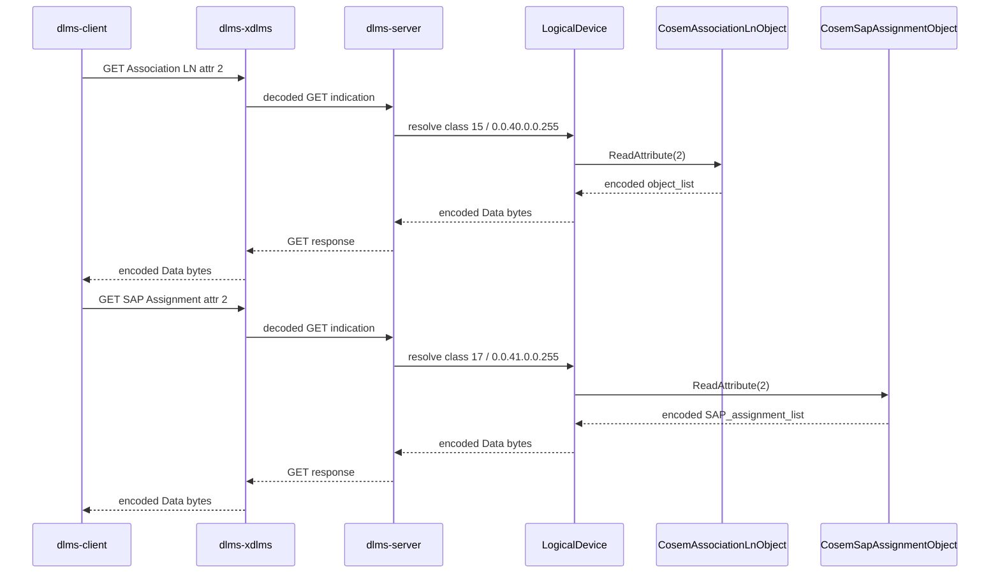
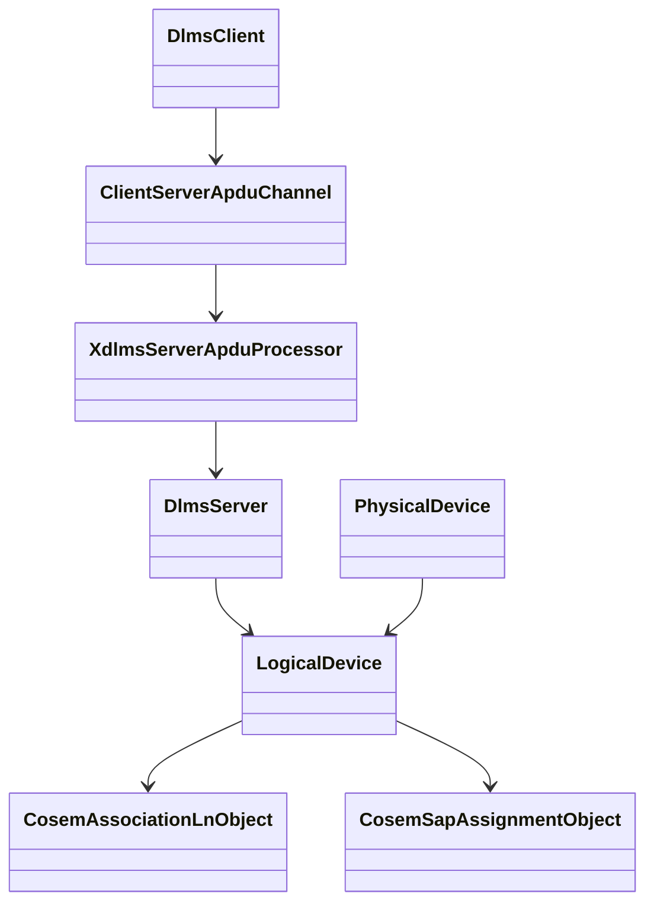

# COSEM Association Discovery Root Integration Plan

## 1. Scope

This phase connects the `dlms-cosem` Association LN and SAP Assignment
discovery objects to the existing root public client/server integration path.

The target path is:

```text
dlms-client -> dlms-xdlms -> dlms-server -> dlms-cosem discovery objects
```

## 2. Requirements

1. Public-client GET integration shall read Association LN attribute `2`
   (`object_list`) from a real `CosemAssociationLnObject`.
2. Public-client GET integration shall read SAP Assignment attribute `2`
   (`SAP_assignment_list`) from a real `CosemSapAssignmentObject`.
3. The Association LN object list shall be built from the same logical-device
   metadata used by `dlms-cosem`, not from a root-local byte fixture.
4. The SAP Assignment list shall be built from `PhysicalDevice`
   logical-device assignments.
5. The root test shall compare encoded DLMS Data bytes only. Typed decoding of
   object-list entries remains out of scope for this integration phase.

## 3. Architecture





## 4. Test Plan

- `ClientGetIntegration.PublicClientReadsAssociationObjectList` shall:
  - register a simple data object;
  - build Association LN metadata from the logical device;
  - register `CosemAssociationLnObject`;
  - open the public client association;
  - GET class `15`, OBIS `0.0.40.0.0.255`, attribute `2`;
  - assert the returned bytes equal `CosemAssociationLnObject::ReadAttribute(2)`.
- `ClientGetIntegration.PublicClientReadsSapAssignmentList` shall:
  - create a physical device with one logical device;
  - register `CosemSapAssignmentObject` built from
    `PhysicalDevice::SapAssignments()`;
  - open the public client association;
  - GET class `17`, OBIS `0.0.41.0.0.255`, attribute `2`;
  - assert the returned bytes equal `CosemSapAssignmentObject::ReadAttribute(2)`.

## 5. Phase Exit Criteria

Documentation phase is complete when this plan is committed in root.

Implementation phase is complete when root MinGW build and root `ctest` pass.
