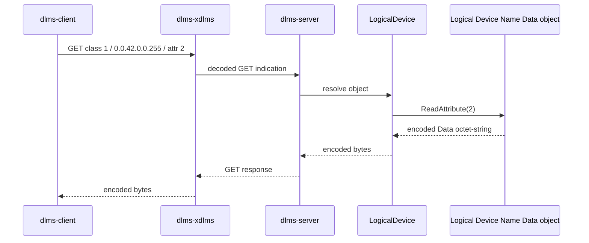
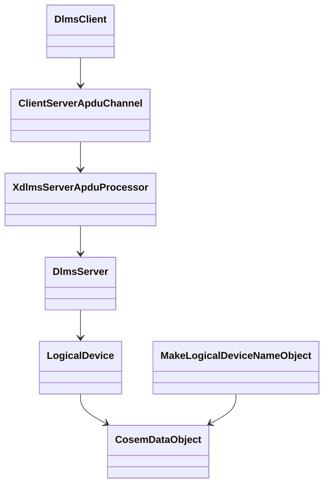

# COSEM Logical Device Name Root Integration Plan

## 1. Scope

This phase connects the `dlms-cosem` Logical Device Name helper to the root
public client/server integration path.

The target path is:

```text
dlms-client -> dlms-xdlms -> dlms-server -> dlms-cosem::CosemDataObject
```

The object is the standard Logical Device Name Data object:

- class id: `1`
- logical name: `0.0.42.0.0.255`
- attribute: `2`

## 2. Requirements

1. Public-client GET integration shall read Logical Device Name attribute `2`
   from an object created by `MakeLogicalDeviceNameObject`.
2. The test shall register the object through the normal `LogicalDevice`
   registry and `dlms-server` path.
3. The root test shall compare encoded DLMS Data bytes only.
4. The phase shall not add a typed string decoder to root.

## 3. Architecture





## 4. Test Plan

- `ClientGetIntegration.PublicClientReadsLogicalDeviceName` shall:
  - create an LDN object with `MakeLogicalDeviceNameObject`;
  - register it on the logical device;
  - open the public client association;
  - GET class `1`, OBIS `0.0.42.0.0.255`, attribute `2`;
  - assert the returned bytes equal `ReadAttribute(2)` from the object.

## 5. Phase Exit Criteria

Documentation phase is complete when this plan is committed in root.

Implementation phase is complete when root MinGW build and root `ctest` pass.
