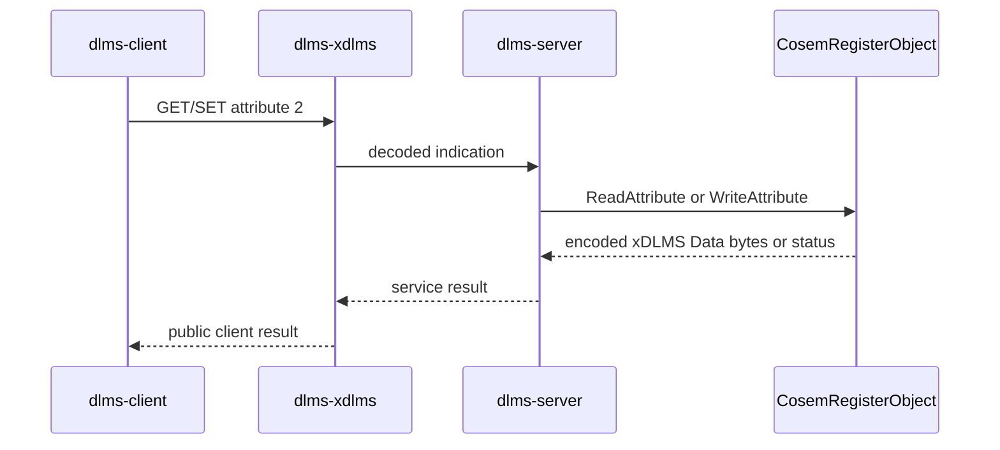
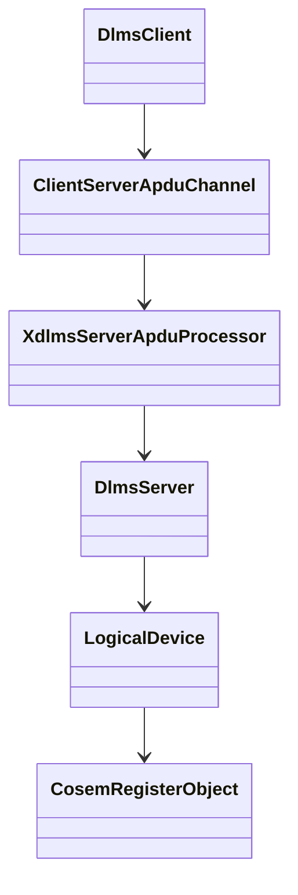

# COSEM Simple Objects Root Integration Plan

## 1. Scope

This phase connects the reusable `dlms-cosem` simple interface objects to the
existing root client/server integration tests.

The target path is:

```text
dlms-client -> dlms-xdlms -> dlms-server -> dlms-cosem::CosemRegisterObject
```

## 2. Requirements

1. Public-client GET integration shall read attribute `2` from a real
   `CosemRegisterObject`.
2. Public-client SET integration shall write attribute `2` to a real
   `CosemRegisterObject`.
3. Public-client SET rejection integration shall use `CosemRegisterObject`
   access rights rather than a root-local fake object.
4. ACTION integration may keep its root-local fake object because the simple
   object phase intentionally does not implement methods.
5. The integration shall not introduce typed COSEM value decoding in root; the
   values remain encoded xDLMS Data bytes.

## 3. Architecture





## 4. Test Plan

- `ClientGetIntegration.PublicClientReadsMinimalServerObject` shall register a
  `CosemRegisterObject` and assert the GET result equals its encoded value.
- `ClientSetIntegration.PublicClientWritesMinimalServerObject` shall register a
  writable `CosemRegisterObject` and assert SET updates the stored value.
- `ClientSetIntegration.PublicClientReportsServiceRejection` shall register a
  read-only `CosemRegisterObject` and assert the public client reports service
  rejection.
- Existing ACTION coverage remains unchanged.

## 5. Phase Exit Criteria

Documentation phase is complete when this plan is committed in root.

Implementation phase is complete when root MinGW build and root `ctest` pass.
