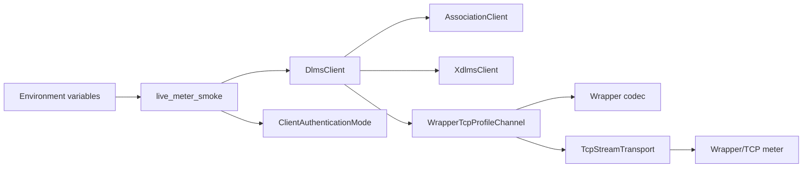
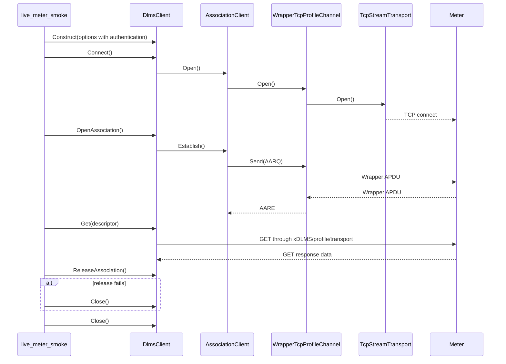

# Live Meter Smoke Plan

## 1. Scope

This document defines the first meter-facing MVP smoke boundary for the root
workspace.

The smoke is not a normal unit or integration test. It is an opt-in executable
path that proves the already assembled client stack can talk to a real
Wrapper/TCP DLMS/COSEM endpoint:

```text
dlms-client
  -> dlms-association
  -> dlms-xdlms
  -> dlms-profile
  -> dlms-wrapper
  -> dlms-transport
  -> real meter endpoint
```

The first smoke target is public-client no-security LN association. The second
target is LLS LN association through the same public client facade. The third
target is password-based HLS High. The fourth target is standard HLS GMAC when
the meter exposes a matching authentication mechanism.

## 2. MVP Requirements

The live smoke shall:

- be disabled by default;
- never run as part of the normal `ctest` suite unless explicitly enabled;
- take endpoint and addressing values from environment variables;
- use `DlmsClient` options composition, not manual lower-layer wiring;
- connect to Wrapper/TCP;
- open a no-security LN association as public client SAP 16 by default;
- optionally open an LLS LN association when explicitly configured;
- optionally open an HLS High LN association when explicitly configured;
- optionally open an HLS GMAC LN association when explicitly configured;
- perform one explicit GET request;
- print a compact status line for connect, association, service, and close;
- return a non-zero process code when connect, association, GET, or close
  fails.

Confirmed release is best-effort for the live smoke. Some meters accept the
service path but fail or omit the confirmed release exchange. The smoke shall
report the release status and fall back to `Close()` so the MVP verdict remains
focused on the public-client service path.

The smoke shall not:

- embed lab IP addresses or credentials in committed source;
- require LLS/HLS passwords for the default public-client smoke;
- transform, hash, derive, persist, or log LLS credential bytes;
- transform, derive, persist, or log HLS GMAC key bytes;
- mutate meter state;
- retry indefinitely;
- make CI depend on live network access.

## 3. Configuration

The executable shall read these environment variables:

| Variable | Default | Meaning |
|---|---:|---|
| `DLMS_LIVE_WRAPPER_HOST` | none | required meter host or IP |
| `DLMS_LIVE_WRAPPER_PORT` | `4059` | Wrapper/TCP port |
| `DLMS_LIVE_CLIENT_SAP` | `16` | client SAP for public no-security access |
| `DLMS_LIVE_SERVER_SAP` | `1` | logical device SAP |
| `DLMS_LIVE_SOURCE_WPORT` | same as client SAP | Wrapper source port |
| `DLMS_LIVE_DEST_WPORT` | same as server SAP | Wrapper destination port |
| `DLMS_LIVE_AUTHENTICATION` | `none` | association authentication mode: `none`, `lls`, `high`, or `hls-gmac` |
| `DLMS_LIVE_LLS_PASSWORD` | none | raw LLS password bytes for `lls` authentication |
| `DLMS_LIVE_HLS_PASSWORD` | none | raw HLS High password bytes for `high` authentication |
| `DLMS_LIVE_CLIENT_SYSTEM_TITLE_HEX` | none | 8-byte hex client system title for `hls-gmac` |
| `DLMS_LIVE_SERVER_SYSTEM_TITLE_HEX` | none | 8-byte hex server system title for `hls-gmac` |
| `DLMS_LIVE_AUTHENTICATION_KEY_HEX` | none | 16-byte hex authentication key for `hls-gmac` |
| `DLMS_LIVE_INVOCATION_COUNTER` | `1` | local invocation counter start for `hls-gmac` |
| `DLMS_LIVE_CLASS_ID` | `1` | GET target COSEM class id |
| `DLMS_LIVE_OBIS` | `0.0.42.0.0.255` | GET target logical name |
| `DLMS_LIVE_ATTRIBUTE_ID` | `2` | GET target attribute id |
| `DLMS_LIVE_CONNECT_TIMEOUT_MS` | `5000` | TCP connect timeout |
| `DLMS_LIVE_REQUEST_TIMEOUT_MS` | `5000` | association and service timeout |

The default GET target is logical device name on a `Data` object. If a meter
uses a different public object list, the caller can override class id, OBIS, and
attribute id without rebuilding.

For LLS, callers shall set `DLMS_LIVE_AUTHENTICATION=lls`,
`DLMS_LIVE_CLIENT_SAP=32`, and `DLMS_LIVE_LLS_PASSWORD=<password>` unless the
target meter uses a different client SAP. The smoke passes the password bytes to
`DlmsClientOptions` exactly as provided by the process environment.

For HLS High, callers shall set `DLMS_LIVE_AUTHENTICATION=high`,
`DLMS_LIVE_CLIENT_SAP=48`, and `DLMS_LIVE_HLS_PASSWORD=<password>` unless the
target meter uses a different client SAP. The smoke passes the password bytes
to `DlmsClientOptions` exactly as provided by the process environment. The
provided certification configs use `HLSPassword=HiPassword` for this mode when
`bGMAC=false`.

For HLS GMAC, callers shall set `DLMS_LIVE_AUTHENTICATION=hls-gmac`,
`DLMS_LIVE_CLIENT_SAP=48`, client/server system titles, and the authentication
key as hex strings. The smoke passes key bytes to `DlmsClientOptions` exactly as
decoded from hex. The provided certification configs use `SystemTitle=12345678`,
`AuthenticationKey=404142434445464748494A4B4C4D4E4F`, and
`BlockCipherKey=303132333435363738393A3B3C3D3E3F` for this mode when
`bGMAC=true`.

## 4. Architecture



The smoke owns only option parsing and status reporting. All protocol work must
remain in the layer repositories.

## 5. Class Interaction



## 6. Test Plan

Normal verification remains deterministic:

```text
cmake --build build-mingw64
ctest --test-dir build-mingw64 --output-on-failure
```

Live verification is manual and opt-in:

```text
DLMS_LIVE_WRAPPER_HOST=<host> ctest --test-dir build-mingw64 -R LiveMeterSmoke --output-on-failure
```

LLS live verification is also manual and opt-in:

```text
DLMS_LIVE_WRAPPER_HOST=<host> DLMS_LIVE_CLIENT_SAP=32 DLMS_LIVE_AUTHENTICATION=lls DLMS_LIVE_LLS_PASSWORD=<password> ctest --test-dir build-mingw64 -R LiveMeterSmoke --output-on-failure
```

HLS GMAC live verification is manual and opt-in:

```text
DLMS_LIVE_WRAPPER_HOST=<host> DLMS_LIVE_CLIENT_SAP=48 DLMS_LIVE_AUTHENTICATION=hls-gmac DLMS_LIVE_CLIENT_SYSTEM_TITLE_HEX=<16 hex chars> DLMS_LIVE_SERVER_SYSTEM_TITLE_HEX=<16 hex chars> DLMS_LIVE_AUTHENTICATION_KEY_HEX=<32 hex chars> ctest --test-dir build-mingw64 -R LiveMeterSmoke --output-on-failure
```

HLS High live verification is manual and opt-in:

```text
DLMS_LIVE_WRAPPER_HOST=192.168.102.38 DLMS_LIVE_CLIENT_SAP=48 DLMS_LIVE_AUTHENTICATION=high DLMS_LIVE_HLS_PASSWORD=HiPassword ctest --test-dir build-mingw64 -R LiveMeterSmoke --output-on-failure
```

If `DLMS_LIVE_WRAPPER_HOST` is absent, the live smoke shall report that it is
skipped and return success when run directly. The CTest entry shall also be
disabled unless the root build option enables live tests.

## 7. Implementation Phases

### Phase 41. Live Meter Smoke Documentation

Deliverables:

- this plan;
- root architecture update describing the opt-in live smoke boundary.

Commit message:

```text
docs: define live meter smoke boundary
```

### Phase 42. Public Client Live Smoke Executable

Deliverables:

- root smoke executable using `DlmsClient`;
- environment parsing helpers;
- disabled-by-default CTest entry;
- build and full deterministic test verification.

Commit message:

```text
test: add opt-in live meter smoke
```

### Phase 43. Optional Public Client 16 Verification

Deliverables:

- run the smoke against an explicitly supplied lab endpoint;
- document observed connect/association/GET status.

Commit message:

```text
test: verify public client live smoke
```

### Phase 48. LLS Live Smoke Documentation

Deliverables:

- live smoke configuration contract for `none` and `lls` authentication;
- manual client SAP 32 verification command;
- explicit credential handling boundary.

Commit message:

```text
docs: define LLS live meter smoke
```

### Phase 49. LLS Live Smoke Implementation

Deliverables:

- authentication mode parsing;
- raw LLS password forwarding to `DlmsClientOptions`;
- deterministic build and test verification.

Commit message:

```text
test: add LLS live meter smoke option
```

### Phase 50. Optional LLS Client 32 Verification

Deliverables:

- run the smoke against an explicitly supplied lab endpoint with client SAP 32;
- document observed connect/association/GET status.

Commit message:

```text
test: verify LLS client live smoke
```

Observed verification:

```text
connect: Ok
association: Ok
get: Ok bytes=17
release: AssociationFailed (close fallback)
close: Ok
```

The release fallback matches the public-client smoke behavior and does not
invalidate the LLS MVP path, which is scoped to connect, association, and a
single read-only GET.

### Phase 51. HLS GMAC Live Smoke Documentation

Deliverables:

- live smoke configuration contract for `hls-gmac`;
- hex key and system-title environment variables;
- explicit separation from proprietary high-password HLS.

Commit message:

```text
docs: define HLS GMAC live meter smoke
```

### Phase 52. HLS GMAC Live Smoke Implementation

Deliverables:

- authentication mode parsing for `hls-gmac`;
- hex parser for system titles and authentication key;
- deterministic build and test verification.

Commit message:

```text
test: add HLS GMAC live meter smoke option
```

### Phase 53. Optional HLS Client 48 Verification

Deliverables:

- run the smoke against an explicitly supplied lab endpoint with client SAP 48
  when HLS GMAC material is available;
- document observed connect/association/GET status or document that the target
  uses a non-GMAC HLS mechanism.

Commit message:

```text
test: verify HLS client live smoke
```

### Phase 54. HLS High Live Smoke Documentation

Deliverables:

- live smoke configuration contract for password-based `high`;
- explicit separation from `hls-gmac` key material;
- client SAP 48 command using the certification `HiPassword` value.

Commit message:

```text
docs: define HLS High live meter smoke
```

### Phase 55. HLS High Live Smoke Implementation

Deliverables:

- authentication mode parsing for `high`;
- raw HLS password forwarding to `DlmsClientOptions`;
- deterministic build and test verification.

Commit message:

```text
test: add HLS High live meter smoke option
```
