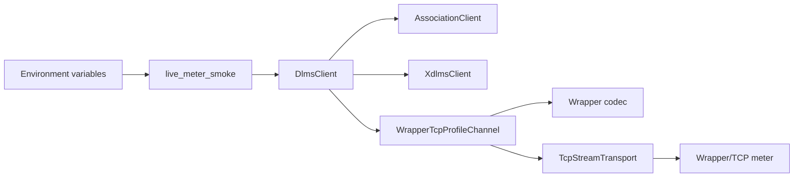
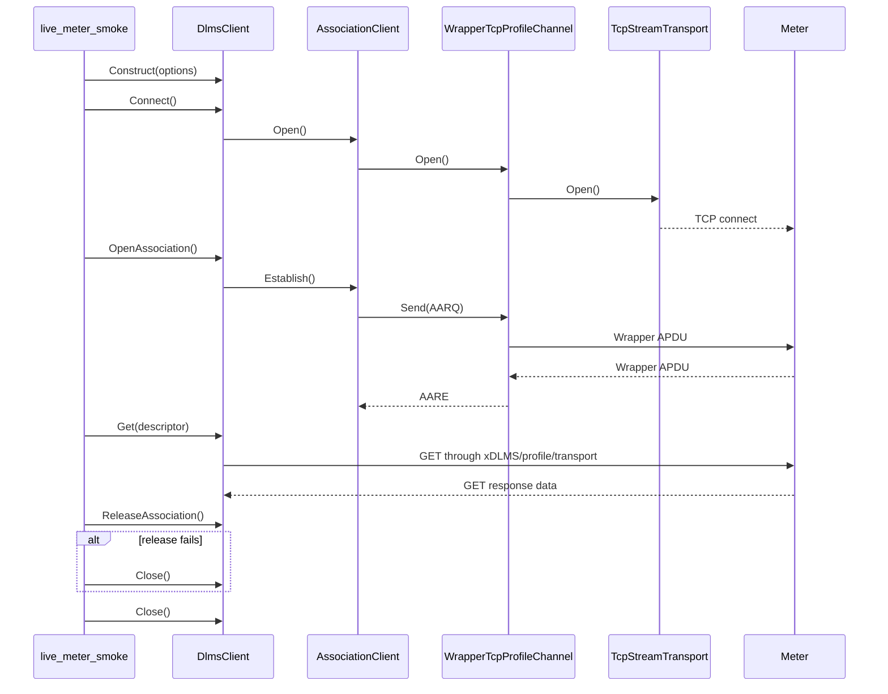

# Live Meter Smoke Plan

## 1. Scope

This document defines the first meter-facing MVP smoke boundary for the root
workspace.

The smoke is not a normal unit or integration test. It is an opt-in executable
path that proves the already assembled client stack can talk to a real
Wrapper/TCP DLMS/COSEM endpoint:

```text
dlms-client
  -> dlms-association
  -> dlms-xdlms
  -> dlms-profile
  -> dlms-wrapper
  -> dlms-transport
  -> real meter endpoint
```

The first smoke target is public-client no-security LN association. LLS and HLS
remain follow-up authentication phases because `dlms-association` still rejects
those authentication modes until ACSE authentication field encoding is enabled.

## 2. MVP Requirements

The live smoke shall:

- be disabled by default;
- never run as part of the normal `ctest` suite unless explicitly enabled;
- take endpoint and addressing values from environment variables;
- use `DlmsClient` options composition, not manual lower-layer wiring;
- connect to Wrapper/TCP;
- open a no-security LN association as public client SAP 16;
- perform one explicit GET request;
- print a compact status line for connect, association, service, and close;
- return a non-zero process code when connect, association, GET, or close
  fails.

Confirmed release is best-effort for the live smoke. Some meters accept the
service path but fail or omit the confirmed release exchange. The smoke shall
report the release status and fall back to `Close()` so the MVP verdict remains
focused on the public-client service path.

The smoke shall not:

- embed lab IP addresses or credentials in committed source;
- require LLS/HLS passwords;
- mutate meter state;
- retry indefinitely;
- make CI depend on live network access.

## 3. Configuration

The executable shall read these environment variables:

| Variable | Default | Meaning |
|---|---:|---|
| `DLMS_LIVE_WRAPPER_HOST` | none | required meter host or IP |
| `DLMS_LIVE_WRAPPER_PORT` | `4059` | Wrapper/TCP port |
| `DLMS_LIVE_CLIENT_SAP` | `16` | client SAP for public no-security access |
| `DLMS_LIVE_SERVER_SAP` | `1` | logical device SAP |
| `DLMS_LIVE_SOURCE_WPORT` | same as client SAP | Wrapper source port |
| `DLMS_LIVE_DEST_WPORT` | same as server SAP | Wrapper destination port |
| `DLMS_LIVE_CLASS_ID` | `1` | GET target COSEM class id |
| `DLMS_LIVE_OBIS` | `0.0.42.0.0.255` | GET target logical name |
| `DLMS_LIVE_ATTRIBUTE_ID` | `2` | GET target attribute id |
| `DLMS_LIVE_CONNECT_TIMEOUT_MS` | `5000` | TCP connect timeout |
| `DLMS_LIVE_REQUEST_TIMEOUT_MS` | `5000` | association and service timeout |

The default GET target is logical device name on a `Data` object. If a meter
uses a different public object list, the caller can override class id, OBIS, and
attribute id without rebuilding.

## 4. Architecture



The smoke owns only option parsing and status reporting. All protocol work must
remain in the layer repositories.

## 5. Class Interaction



## 6. Test Plan

Normal verification remains deterministic:

```text
cmake --build build-mingw64
ctest --test-dir build-mingw64 --output-on-failure
```

Live verification is manual and opt-in:

```text
DLMS_LIVE_WRAPPER_HOST=<host> ctest --test-dir build-mingw64 -R LiveMeterSmoke --output-on-failure
```

If `DLMS_LIVE_WRAPPER_HOST` is absent, the live smoke shall report that it is
skipped and return success when run directly. The CTest entry shall also be
disabled unless the root build option enables live tests.

## 7. Implementation Phases

### Phase 41. Live Meter Smoke Documentation

Deliverables:

- this plan;
- root architecture update describing the opt-in live smoke boundary.

Commit message:

```text
docs: define live meter smoke boundary
```

### Phase 42. Public Client Live Smoke Executable

Deliverables:

- root smoke executable using `DlmsClient`;
- environment parsing helpers;
- disabled-by-default CTest entry;
- build and full deterministic test verification.

Commit message:

```text
test: add opt-in live meter smoke
```

### Phase 43. Optional Public Client 16 Verification

Deliverables:

- run the smoke against an explicitly supplied lab endpoint;
- document observed connect/association/GET status.

Commit message:

```text
test: verify public client live smoke
```
