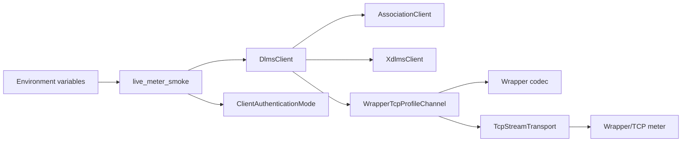
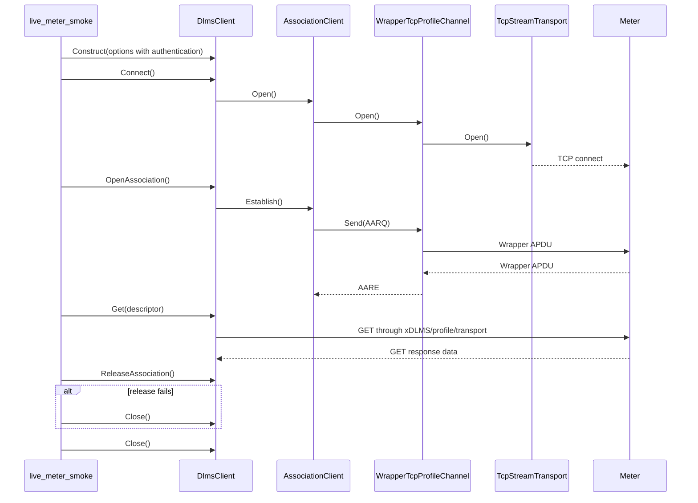

# Live Meter Smoke Plan

## 1. Scope

This document defines the first meter-facing MVP smoke boundary for the root
workspace.

The smoke is not a normal unit or integration test. It is an opt-in executable
path that proves the already assembled client stack can talk to a real
Wrapper/TCP DLMS/COSEM endpoint:

```text
dlms-client
  -> dlms-association
  -> dlms-xdlms
  -> dlms-profile
  -> dlms-wrapper
  -> dlms-transport
  -> real meter endpoint
```

The first smoke target is public-client no-security LN association. The second
target is LLS LN association through the same public client facade. The third
target is password-based HLS High. The fourth target is standard HLS GMAC when
the meter exposes a matching authentication mechanism.

## 2. MVP Requirements

The live smoke shall:

- be disabled by default;
- never run as part of the normal `ctest` suite unless explicitly enabled;
- take endpoint and addressing values from environment variables;
- use `DlmsClient` options composition, not manual lower-layer wiring;
- connect to Wrapper/TCP;
- open a no-security LN association as public client SAP 16 by default;
- optionally open an LLS LN association when explicitly configured;
- optionally open an HLS High LN association when explicitly configured;
- optionally open an HLS GMAC LN association when explicitly configured;
- perform one explicit GET request;
- print a compact status line for connect, association, service, and close;
- return a non-zero process code when connect, association, GET, or close
  fails.

Confirmed release is best-effort for the live smoke. Some meters accept the
service path but fail or omit the confirmed release exchange. The smoke shall
report the release status and fall back to `Close()` so the MVP verdict remains
focused on the public-client service path.

The smoke shall not:

- embed lab IP addresses or credentials in committed source;
- require LLS/HLS passwords for the default public-client smoke;
- transform, hash, derive, persist, or log LLS credential bytes;
- transform, derive, persist, or log HLS GMAC key bytes;
- log LLS/HLS passwords or GMAC key material, including in trace mode;
- mutate meter state;
- retry indefinitely;
- make CI depend on live network access.

## 3. Configuration

The executable shall read these environment variables:

| Variable | Default | Meaning |
|---|---:|---|
| `DLMS_LIVE_PROFILE` | `wrapper-tcp` | client profile: `wrapper-tcp` or `hdlc-tcp` |
| `DLMS_LIVE_TRACE` | unset | when set to `1`, print non-secret live smoke configuration and profile frame metadata |
| `DLMS_LIVE_WRAPPER_HOST` | none | required meter host or IP |
| `DLMS_LIVE_WRAPPER_PORT` | `4059` | TCP port used by the selected live profile |
| `DLMS_LIVE_CLIENT_SAP` | `16` | client SAP for public no-security access |
| `DLMS_LIVE_SERVER_SAP` | `1` | logical device SAP |
| `DLMS_LIVE_SOURCE_WPORT` | same as client SAP | Wrapper source port |
| `DLMS_LIVE_DEST_WPORT` | same as server SAP | Wrapper destination port |
| `DLMS_LIVE_HDLC_CLIENT_ADDRESS` | same as client SAP | HDLC client address for `hdlc-tcp` |
| `DLMS_LIVE_HDLC_LOGICAL_DEVICE_ADDRESS` | same as server SAP | HDLC logical device address for `hdlc-tcp` |
| `DLMS_LIVE_HDLC_PHYSICAL_DEVICE_ADDRESS` | `0` | HDLC physical device address for `hdlc-tcp` |
| `DLMS_LIVE_HDLC_MAX_INFO_TX` | `128` | HDLC max information field transmit for `hdlc-tcp` |
| `DLMS_LIVE_HDLC_MAX_INFO_RX` | `128` | HDLC max information field receive for `hdlc-tcp` |
| `DLMS_LIVE_HDLC_WINDOW_TX` | `1` | HDLC transmit window size for `hdlc-tcp` |
| `DLMS_LIVE_HDLC_WINDOW_RX` | `1` | HDLC receive window size for `hdlc-tcp` |
| `DLMS_LIVE_HDLC_RETRY_COUNT` | `3` | HDLC control-frame retry count for `hdlc-tcp` |
| `DLMS_LIVE_HDLC_RETRY_DELAY_MS` | `10` | HDLC retry delay for `hdlc-tcp` |
| `DLMS_LIVE_AUTHENTICATION` | `none` | association authentication mode: `none`, `lls`, `high`, or `hls-gmac` |
| `DLMS_LIVE_LLS_PASSWORD` | none | raw LLS password bytes for `lls` authentication |
| `DLMS_LIVE_HLS_PASSWORD` | none | raw HLS High password bytes for `high` authentication |
| `DLMS_LIVE_CLIENT_SYSTEM_TITLE_HEX` | none | 8-byte hex client system title for `hls-gmac` |
| `DLMS_LIVE_SERVER_SYSTEM_TITLE_HEX` | optional | 8-byte hex server system title for `hls-gmac`; if absent, use the AARE responding AP title |
| `DLMS_LIVE_AUTHENTICATION_KEY_HEX` | none | 16-byte hex authentication key for `hls-gmac` |
| `DLMS_LIVE_INVOCATION_COUNTER` | `1` | local invocation counter start for `hls-gmac` |
| `DLMS_LIVE_PROPOSED_DLMS_VERSION` | `6` | AARQ proposed DLMS version number |
| `DLMS_LIVE_PROPOSED_CONFORMANCE_HEX` | `007E1F` | AARQ proposed-conformance bitmap, exactly 6 hex chars |
| `DLMS_LIVE_CLIENT_MAX_PDU_SIZE` | `512` | AARQ proposed client max receive PDU size |
| `DLMS_LIVE_CLASS_ID` | `1` | GET target COSEM class id |
| `DLMS_LIVE_OBIS` | `0.0.42.0.0.255` | GET target logical name |
| `DLMS_LIVE_ATTRIBUTE_ID` | `2` | GET target attribute id |
| `DLMS_LIVE_CONNECT_TIMEOUT_MS` | `5000` | TCP connect timeout |
| `DLMS_LIVE_REQUEST_TIMEOUT_MS` | `5000` | association and service timeout |

The default GET target is logical device name on a `Data` object. If a meter
uses a different public object list, the caller can override class id, OBIS, and
attribute id without rebuilding.

For HDLC over TCP, callers shall set `DLMS_LIVE_PROFILE=hdlc-tcp`. The TCP host
and port remain configured by `DLMS_LIVE_WRAPPER_HOST` and
`DLMS_LIVE_WRAPPER_PORT` for backward compatibility with existing smoke
commands. HDLC addressing can be configured independently with the
`DLMS_LIVE_HDLC_*` variables. The provided TCP/HDLC legacy configuration uses
logical device address `1`, physical device address `1`, and max information
field sizes `256`.

For LLS, callers shall set `DLMS_LIVE_AUTHENTICATION=lls`,
`DLMS_LIVE_CLIENT_SAP=32`, and `DLMS_LIVE_LLS_PASSWORD=<password>` unless the
target meter uses a different client SAP. The smoke passes the password bytes to
`DlmsClientOptions` exactly as provided by the process environment.

For HLS High, callers shall set `DLMS_LIVE_AUTHENTICATION=high`,
`DLMS_LIVE_CLIENT_SAP=48`, and `DLMS_LIVE_HLS_PASSWORD=<password>` unless the
target meter uses a different client SAP. The smoke passes the password bytes
to `DlmsClientOptions` exactly as provided by the process environment. The
provided certification configs use `HLSPassword=HiPassword` for this mode when
`bGMAC=false`.

For HLS GMAC, callers shall set `DLMS_LIVE_AUTHENTICATION=hls-gmac`,
`DLMS_LIVE_CLIENT_SAP=48`, client system title, and the authentication key as
hex strings. The server system title can be provided explicitly or discovered
from the AARE responding AP title. The smoke passes key bytes to
`DlmsClientOptions` exactly as decoded from hex. The provided certification
configs use `SystemTitle=12345678`,
`AuthenticationKey=404142434445464748494A4B4C4D4E4F`, and
`BlockCipherKey=303132333435363738393A3B3C3D3E3F` for this mode when
`bGMAC=true`.

For certification-profile parity, callers can set
`DLMS_LIVE_PROPOSED_DLMS_VERSION` and
`DLMS_LIVE_PROPOSED_CONFORMANCE_HEX` to the three-byte xDLMS
proposed-conformance bitmap encoded as six hex characters. The default keeps
the current association version `6` and conformance value `007E1F`. The
pyDlmsCertification YellowBook probes use DLMS version `5` as a negative probe
and `0060FE9F` for the .NET/Gurux conformance profile in selected AARQ tests.

## 4. Architecture



The smoke owns only option parsing and status reporting. All protocol work must
remain in the layer repositories.

## 5. Class Interaction



## 6. Test Plan

Normal verification remains deterministic:

```text
cmake --build build-mingw64
ctest --test-dir build-mingw64 --output-on-failure
```

Live verification is manual and opt-in:

```text
DLMS_LIVE_WRAPPER_HOST=<host> ctest --test-dir build-mingw64 -R LiveMeterSmoke --output-on-failure
```

LLS live verification is also manual and opt-in:

```text
DLMS_LIVE_WRAPPER_HOST=<host> DLMS_LIVE_CLIENT_SAP=32 DLMS_LIVE_AUTHENTICATION=lls DLMS_LIVE_LLS_PASSWORD=<password> ctest --test-dir build-mingw64 -R LiveMeterSmoke --output-on-failure
```

HLS GMAC live verification is manual and opt-in:

```text
DLMS_LIVE_WRAPPER_HOST=<host> DLMS_LIVE_CLIENT_SAP=48 DLMS_LIVE_AUTHENTICATION=hls-gmac DLMS_LIVE_CLIENT_SYSTEM_TITLE_HEX=<16 hex chars> DLMS_LIVE_AUTHENTICATION_KEY_HEX=<32 hex chars> ctest --test-dir build-mingw64 -R LiveMeterSmoke --output-on-failure
```

HLS High live verification is manual and opt-in:

```text
DLMS_LIVE_WRAPPER_HOST=192.168.102.38 DLMS_LIVE_CLIENT_SAP=48 DLMS_LIVE_AUTHENTICATION=high DLMS_LIVE_HLS_PASSWORD=HiPassword ctest --test-dir build-mingw64 -R LiveMeterSmoke --output-on-failure
```

HDLC/TCP live verification is manual and opt-in:

```text
DLMS_LIVE_PROFILE=hdlc-tcp DLMS_LIVE_WRAPPER_HOST=192.168.102.38 DLMS_LIVE_HDLC_PHYSICAL_DEVICE_ADDRESS=1 DLMS_LIVE_HDLC_MAX_INFO_TX=256 DLMS_LIVE_HDLC_MAX_INFO_RX=256 ctest --test-dir build-mingw64 -R LiveMeterSmoke --output-on-failure
```

If `DLMS_LIVE_WRAPPER_HOST` is absent, the live smoke shall report that it is
skipped and return success when run directly. The CTest entry shall also be
disabled unless the root build option enables live tests.

## 7. Implementation Phases

### Phase 41. Live Meter Smoke Documentation

Deliverables:

- this plan;
- root architecture update describing the opt-in live smoke boundary.

Commit message:

```text
docs: define live meter smoke boundary
```

### Phase 42. Public Client Live Smoke Executable

Deliverables:

- root smoke executable using `DlmsClient`;
- environment parsing helpers;
- disabled-by-default CTest entry;
- build and full deterministic test verification.

Commit message:

```text
test: add opt-in live meter smoke
```

### Phase 43. Optional Public Client 16 Verification

Deliverables:

- run the smoke against an explicitly supplied lab endpoint;
- document observed connect/association/GET status.

Commit message:

```text
test: verify public client live smoke
```

### Phase 48. LLS Live Smoke Documentation

Deliverables:

- live smoke configuration contract for `none` and `lls` authentication;
- manual client SAP 32 verification command;
- explicit credential handling boundary.

Commit message:

```text
docs: define LLS live meter smoke
```

### Phase 49. LLS Live Smoke Implementation

Deliverables:

- authentication mode parsing;
- raw LLS password forwarding to `DlmsClientOptions`;
- deterministic build and test verification.

Commit message:

```text
test: add LLS live meter smoke option
```

### Phase 50. Optional LLS Client 32 Verification

Deliverables:

- run the smoke against an explicitly supplied lab endpoint with client SAP 32;
- document observed connect/association/GET status.

Commit message:

```text
test: verify LLS client live smoke
```

Observed verification:

```text
connect: Ok
association: Ok
get: Ok bytes=17
release: AssociationFailed (close fallback)
close: Ok
```

The release fallback matches the public-client smoke behavior and does not
invalidate the LLS MVP path, which is scoped to connect, association, and a
single read-only GET.

### Phase 51. HLS GMAC Live Smoke Documentation

Deliverables:

- live smoke configuration contract for `hls-gmac`;
- hex key and system-title environment variables;
- explicit separation from proprietary high-password HLS.

Commit message:

```text
docs: define HLS GMAC live meter smoke
```

### Phase 52. HLS GMAC Live Smoke Implementation

Deliverables:

- authentication mode parsing for `hls-gmac`;
- hex parser for system titles and authentication key;
- deterministic build and test verification.

Commit message:

```text
test: add HLS GMAC live meter smoke option
```

### Phase 53. Optional HLS Client 48 Verification

Deliverables:

- run the smoke against an explicitly supplied lab endpoint with client SAP 48
  when HLS GMAC material is available;
- document observed connect/association/GET status or document that the target
  uses a non-GMAC HLS mechanism.

Commit message:

```text
test: verify HLS client live smoke
```

### Phase 54. HLS High Live Smoke Documentation

Deliverables:

- live smoke configuration contract for password-based `high`;
- explicit separation from `hls-gmac` key material;
- client SAP 48 command using the certification `HiPassword` value.

Commit message:

```text
docs: define HLS High live meter smoke
```

### Phase 55. HLS High Live Smoke Implementation

Deliverables:

- authentication mode parsing for `high`;
- raw HLS password forwarding to `DlmsClientOptions`;
- deterministic build and test verification.

Commit message:

```text
test: add HLS High live meter smoke option
```

### Phase 56. Optional HLS High Client 48 Verification

Deliverables:

- run the smoke against `192.168.102.38:4059` with client SAP 48 and
  `DLMS_LIVE_HLS_PASSWORD=HiPassword`;
- document observed connect/association/GET status.

Commit message:

```text
test: verify HLS High client live smoke
```

Observed verification:

```text
connect: Ok
association: Ok
get: Ok bytes=17
release: AssociationFailed (close fallback)
close: Ok
```

### Phase 57. HLS GMAC Server Title Discovery

Deliverables:

- expose AARE responding AP title from `dlms-association`;
- allow `dlms-client` HLS GMAC to use the discovered title when
  `DLMS_LIVE_SERVER_SYSTEM_TITLE_HEX` is not set;
- keep explicit server title override support.

Commit message:

```text
feat(client): discover HLS GMAC server title from AARE
```

### Phase 58. HDLC/TCP Live Smoke Documentation

Deliverables:

- live smoke profile selector contract;
- HDLC/TCP addressing and negotiation environment variables;
- manual command for the TCP/HDLC legacy endpoint.

Commit message:

```text
docs: define HDLC TCP live meter smoke
```

### Phase 59. HDLC/TCP Live Smoke Implementation

Deliverables:

- parse `DLMS_LIVE_PROFILE=hdlc-tcp`;
- map HDLC/TCP environment variables into `DlmsClientOptions`;
- keep `wrapper-tcp` as the default;
- deterministic build and test verification.

Commit message:

```text
test: add HDLC TCP live meter smoke option
```

### Phase 60. Optional HDLC/TCP Verification

Deliverables:

- run the smoke against `192.168.102.38:4059` with `hdlc-tcp`;
- document observed connect/association/GET status.

Commit message:

```text
test: verify HDLC TCP live smoke
```

Observed verification against `192.168.102.38:4059`:

Wrapper/TCP public, LLS, and HLS High all reached TCP connect but failed before
AARE:

```text
connect: Ok
association: ReceiveFailed
```

HDLC/TCP public client reached TCP open but did not receive a UA during HDLC
data-link setup. Both logical+physical server address `1/1` and logical-only
server address `1/0` were tried:

```text
connect: ChannelOpenFailed
```

This keeps the deterministic MVP path valid, but live verification now needs a
lower-level trace phase to distinguish endpoint mode, addressing, and meter
response behavior.

### Phase 61. Live Smoke Configuration Trace Documentation

Deliverables:

- `DLMS_LIVE_TRACE=1` contract;
- explicit non-secret trace boundary.

Commit message:

```text
docs: define live smoke configuration trace
```

### Phase 62. Live Smoke Configuration Trace Implementation

Deliverables:

- print selected profile, endpoint, SAP, Wrapper ports, and HDLC addressing
  when `DLMS_LIVE_TRACE=1`;
- never print passwords, keys, system titles, or invocation counter values;
- deterministic build and test verification.

Commit message:

```text
test: add live smoke configuration trace
```

### Phase 63. Wrapper/TCP Frame Trace Documentation

Deliverables:

- document that `DLMS_LIVE_TRACE=1` includes WRAPPER/TCP frame metadata for
  the live smoke;
- keep trace output metadata-only by default;
- explicitly exclude passwords, keys, system titles, invocation counters, and
  full APDU payloads.

Commit message:

```text
docs: define live smoke Wrapper TCP trace
```

### Phase 64. Wrapper/TCP Frame Trace Implementation

Deliverables:

- implement a live smoke `IWrapperTcpTraceSink`;
- wire the sink through `DlmsClientOptions`;
- print outbound encoded frame, inbound decoded frame, read failure, and decode
  failure metadata when `DLMS_LIVE_TRACE=1`;
- run live WRAPPER legacy public, LLS, and High attempts against the lab meter.

Commit message:

```text
test: add live smoke Wrapper TCP trace
```

Observed verification against WRAPPER legacy mode on `192.168.102.38:4059`:

```text
client 16 none:
trace: wrapper-frame kind=encoded-frame direction=out status=Ok sourceWPort=16 destWPort=1 encodedSize=28 apduSize=20 byteSize=28
trace: wrapper-frame kind=read-status direction=in status=Timeout sourceWPort=0 destWPort=0 encodedSize=0 apduSize=0 byteSize=0
association: ReceiveFailed

client 32 LLS/password:
trace: wrapper-frame kind=encoded-frame direction=out status=Ok sourceWPort=32 destWPort=1 encodedSize=53 apduSize=45 byteSize=53
trace: wrapper-frame kind=read-status direction=in status=Timeout sourceWPort=0 destWPort=0 encodedSize=0 apduSize=0 byteSize=0
association: ReceiveFailed

client 48 High/HiPassword:
trace: wrapper-frame kind=encoded-frame direction=out status=Ok sourceWPort=48 destWPort=1 encodedSize=61 apduSize=53 byteSize=61
trace: wrapper-frame kind=read-status direction=in status=ConnectionClosed sourceWPort=0 destWPort=0 encodedSize=0 apduSize=0 byteSize=0
association: ReceiveFailed
```

The client writes AARQ WRAPPER frames successfully. For clients 16 and 32 the
meter does not return a WRAPPER frame before timeout. For client 48 the meter
closes the TCP connection after AARQ.

### Phase 65. Association Metadata Trace Documentation

Deliverables:

- document that `DLMS_LIVE_TRACE=1` includes non-secret association metadata;
- include reference notes from `E:\work\pyDlmsCertification`:
  - pilot WRAPPER uses `serverAddress=PhysicalAddress`;
  - pilot response timeout is `15` seconds;
  - pilot LLS/HLS PDU size is `2048`;
  - pilot WRAPPER legacy passwords are `password` and `HiPassword`;
- keep credentials and challenge bytes out of trace output.

Commit message:

```text
docs: define live smoke association trace
```

### Phase 66. Association Metadata Trace Implementation

Deliverables:

- implement a live smoke `IAssociationTraceSink`;
- wire the sink through `DlmsClientOptions`;
- print AARQ metadata: auth mode, HLS mechanism, proposed DLMS version,
  conformance bytes, client max PDU size, encoded AARQ size, ACSE field
  tags/sizes, and authentication-value length only;
- print AARE receive failure metadata when no AARE is received.

Commit message:

```text
test: add live smoke association trace
```

### Phase 67. Live Smoke Client Max PDU Documentation

Deliverables:

- document `DLMS_LIVE_CLIENT_MAX_PDU_SIZE`;
- note that `pyDlmsCertification` pilot config uses `2048` for LLS/HLS;
- keep default `512` for compatibility with the current association default.

Commit message:

```text
docs: define live smoke client max PDU option
```

### Phase 68. Live Smoke Client Max PDU Implementation

Deliverables:

- parse `DLMS_LIVE_CLIENT_MAX_PDU_SIZE`;
- forward it into `DlmsClientOptions::associationClientMaxReceivePduSize`;
- show the value through existing association trace output;
- deterministic build and test verification.

Commit message:

```text
test: add live smoke client max PDU option
```

### Phase 69. Live Smoke Proposed Conformance Documentation

Deliverables:

- document `DLMS_LIVE_PROPOSED_CONFORMANCE_HEX`;
- keep default `007E1F` for compatibility with the current association
  default;
- note the pyDlmsCertification/Gurux `.NET` profile value `0060FE9F`.

Commit message:

```text
docs: define live smoke conformance option
```

### Phase 70. Live Smoke Proposed Conformance Implementation

Deliverables:

- parse optional six-character conformance hex;
- forward it into `DlmsClientOptions::associationProposedConformance`;
- show the value through existing association trace output;
- deterministic build and test verification.

Commit message:

```text
test: add live smoke conformance option
```

### Phase 71. Live Smoke Proposed DLMS Version Documentation

Deliverables:

- document `DLMS_LIVE_PROPOSED_DLMS_VERSION`;
- keep default `6` for compatibility with the current association default;
- note the pyDlmsCertification YellowBook negative probe value `5`.

Commit message:

```text
docs: define live smoke DLMS version option
```

### Phase 72. Live Smoke Proposed DLMS Version Implementation

Deliverables:

- parse optional non-zero DLMS version value;
- forward it into `DlmsClientOptions::associationProposedDlmsVersionNumber`;
- show the value through existing association trace output;
- deterministic build and test verification.

Commit message:

```text
test: add live smoke DLMS version option
```
