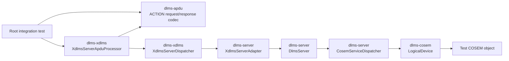
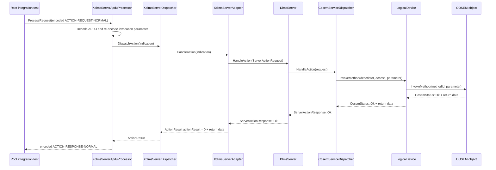

# Server ACTION APDU Integration Plan

## 1. Scope

This document defines the root integration boundary for a server-side
`ACTION-REQUEST-NORMAL` APDU reaching a COSEM object method through the
existing layer repositories.

In scope:

- encode a normal ACTION request APDU in the root integration test;
- process it through `dlms-xdlms::XdlmsServerApduProcessor`;
- dispatch the decoded indication through `dlms-server::XdlmsServerAdapter`;
- invoke a COSEM object method through `dlms-cosem::LogicalDevice`;
- encode and decode the resulting normal ACTION response APDU;
- verify success with return data and method access failure paths.

Out of scope:

- association negotiation;
- ciphered or authenticated APDUs;
- ACTION with list;
- ACTION block transfer;
- transport I/O over Wrapper/TCP or HDLC;
- persistence of COSEM object state outside the test object.

## 2. Requirements

1. The root integration test shall use only public headers from participating
   layer repositories.
2. `ACTION-REQUEST-NORMAL` with a permitted method shall return
   `ACTION-RESPONSE-NORMAL` with action-result `0`.
3. Optional invocation parameter bytes shall reach the COSEM object unchanged.
4. Optional method return bytes shall be encoded as the response return
   parameter.
5. A denied method invocation shall return a normal ACTION response with a
   non-zero action-result, not a transport or APDU processing failure.
6. Existing GET and SET root integration tests shall remain enabled and green.

## 3. API Boundary

The integration path uses these public contracts:

```text
dlms-apdu
  Encode/decode XDLMS ACTION APDUs and DLMS Data values.

dlms-xdlms
  XdlmsServerApduProcessor decodes ACTION request bytes and encodes response
  bytes.
  XdlmsServerDispatcher routes ActionIndication to IXdlmsServerHandler.

dlms-server
  XdlmsServerAdapter maps ActionIndication to ServerActionRequest.
  DlmsServer and CosemServiceDispatcher invoke the COSEM method.

dlms-cosem
  LogicalDevice locates the object and calls ICosemObject::InvokeMethod.
```

No root-only production adapter is introduced. The root test proves that the
public layer contracts compose.

## 4. Architecture



## 5. Success Flow



## 6. Test Plan

Add focused root integration cases to the existing server APDU integration
executable:

- `ActionRequestApduInvokesCosemObject`
  - registers a COSEM object with method access;
  - sends `ACTION-REQUEST-NORMAL` with an invocation parameter;
  - verifies `XdlmsStatus::Ok`;
  - decodes `ACTION-RESPONSE-NORMAL`;
  - verifies invoke-id/priority mirroring, action-result `0`, and return data;
  - verifies the object received the encoded invocation parameter bytes.

- `ActionRequestApduReportsAccessDenied`
  - registers a COSEM object with a denied method;
  - sends `ACTION-REQUEST-NORMAL`;
  - verifies `XdlmsStatus::Ok`;
  - decodes `ACTION-RESPONSE-NORMAL`;
  - verifies the non-zero action-result and no return parameter.

### Verification Commands

```text
cmake -S . -B build-mingw64 -G "MinGW Makefiles"
cmake --build build-mingw64
ctest --test-dir build-mingw64 --output-on-failure
```

## 7. Phase Exit Criteria

The documentation phase is complete when this plan is committed in the root
repository.

The implementation phase is complete when the new root integration tests pass
with the full root test suite.
