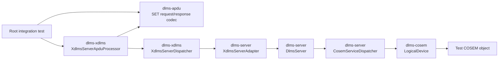
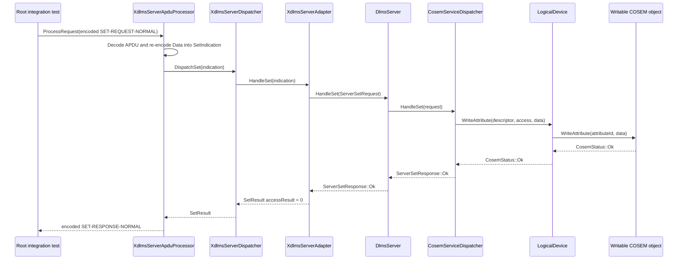

# Server SET APDU Integration Plan

## 1. Scope

This document defines the root integration boundary for a server-side
`SET-REQUEST-NORMAL` APDU reaching a COSEM object through the existing layer
repositories.

In scope:

- encode a normal SET request APDU in the root integration test;
- process it through `dlms-xdlms::XdlmsServerApduProcessor`;
- dispatch the decoded indication through `dlms-server::XdlmsServerAdapter`;
- write the encoded DLMS `Data` value through `dlms-cosem::LogicalDevice`;
- encode and decode the resulting normal SET response APDU;
- verify success and access-denied response paths.

Out of scope:

- association negotiation;
- ciphered or authenticated APDUs;
- selective access;
- block transfer SET forms;
- transport I/O over Wrapper/TCP or HDLC;
- persistence of COSEM object values outside the test object.

## 2. Requirements

1. The root integration test shall use only public headers from participating
   component directories in the root repository.
2. The test shall not introduce ownership cycles between `dlms-server`,
   `dlms-xdlms`, and `dlms-cosem`.
3. `SET-REQUEST-NORMAL` with a writable attribute shall return
   `SET-RESPONSE-NORMAL` with data-access-result `0`.
4. The COSEM object shall receive the encoded DLMS `Data` bytes unchanged.
5. The written value shall be readable from the object after the SET path
   completes.
6. A write to a read-only attribute shall return a normal SET response with an
   access-denied data-access-result, not a transport or APDU processing failure.
7. The root build shall keep existing integration tests enabled and green.

## 3. API Boundary

The integration path uses these public contracts:

```text
dlms-apdu
  Make/encode/decode XDLMS APDUs and DLMS Data values.

dlms-xdlms
  XdlmsServerApduProcessor decodes APDU bytes and encodes response bytes.
  XdlmsServerDispatcher routes SetIndication to IXdlmsServerHandler.

dlms-server
  XdlmsServerAdapter maps SetIndication to ServerSetRequest.
  DlmsServer and CosemServiceDispatcher write through ServerContext.

dlms-cosem
  LogicalDevice locates the object and calls ICosemObject::WriteAttribute.
```

No root-only production adapter is introduced in this phase. The root test
exists to prove that the public contracts compose.

## 4. Architecture



## 5. Success Flow



## 6. Test Plan

### Root Integration Tests

Add a root integration executable or extend the existing server APDU
integration executable with focused SET cases:

- `SetRequestApduWritesCosemObject`
  - registers a writable `Data` object;
  - sends `SET-REQUEST-NORMAL` for attribute `2`;
  - verifies `XdlmsStatus::Ok`;
  - decodes `SET-RESPONSE-NORMAL`;
  - verifies invoke-id/priority mirroring and access-result `0`;
  - verifies the object stored the exact encoded DLMS `Data` bytes.

- `SetRequestApduReportsAccessDenied`
  - registers a read-only object or attribute;
  - sends the same normal SET request;
  - verifies `XdlmsStatus::Ok`;
  - decodes `SET-RESPONSE-NORMAL`;
  - verifies the access-denied data-access-result.

### Verification Commands

```text
cmake -S . -B build-mingw64 -G "MinGW Makefiles"
cmake --build build-mingw64
ctest --test-dir build-mingw64 --output-on-failure
```

## 7. Phase Exit Criteria

The documentation phase is complete when this plan is committed in the root
repository.

The implementation phase is complete when the new root integration tests pass
with the full root test suite.
