# DLMS/COSEM System Architecture

## 1. Scope

This document describes the target architecture of the DLMS/COSEM framework
hosted by this integration repository.

The root repository is an integration workspace. Each protocol or service layer
is expected to live in its own self-contained repository under `lib/`, following
the existing pattern used by `dlms-hdlc`, `dlms-llc`, `dlms-wrapper`, and
`dlms-apdu`.

The architecture is intentionally layered:

- codec repositories encode and decode protocol data units;
- profile repositories bind codecs to transport channels;
- application repositories implement DLMS/COSEM state machines and services;
- object-model repositories implement COSEM server resources and access rules;
- facade repositories expose ergonomic client/server APIs.

## 2. Fixed Design Decisions

| Area | Decision |
|---|---|
| Repository model | One self-contained repository per layer |
| Integration repository | Root `dlms` repository wires layers together and hosts cross-layer tests |
| Language | C++11 unless a layer explicitly documents otherwise |
| Build system | CMake 3.16+ |
| Runtime errors | Status codes only |
| Runtime exceptions | Not used in public/runtime API paths |
| Tests | GoogleTest for C++ layers |
| Dependencies | Downward-only dependencies; no dependency cycles |
| C ABI | Optional per layer; stable and documented when present |
| Documentation | Requirements, API, architecture, and test-plan documents per layer |

## 3. Current Implemented Layers

The following repositories already exist or are present in the current workspace:

| Repository | Responsibility |
|---|---|
| `lib/dlms-hdlc` | HDLC Type 3 frame codec, stream decoder, segmentation support, and transport-independent HDLC session state machine |
| `lib/dlms-llc` | DLMS/COSEM LLC LPDU codec for the 3-layer HDLC-based profile |
| `lib/dlms-wrapper` | DLMS/COSEM Wrapper WPDU codec for TCP/UDP/IP-based profiles |
| `lib/dlms-apdu` | DLMS/COSEM application APDU codec: ACSE BER and xDLMS A-XDR |
| `lib/dlms-transport` | Protocol-neutral TCP, UDP, serial, timer, tracing, and transport adapter primitives |
| `lib/dlms-profile` | APDU channels over Wrapper/TCP, Wrapper/UDP, and HDLC/LLC profiles |
| `lib/dlms-association` | Client-side DLMS/COSEM Application Association state machine for no-security LN open |
| `lib/dlms-xdlms` | Client and server xDLMS GET, SET, ACTION service orchestration and security APDU boundary |
| `lib/dlms-security` | Suite 0 AES-GCM APDU protection, key-store interfaces, and invocation counter stores |
| `lib/dlms-cosem` | Minimal COSEM logical-device model, object registry, access rights, and server resource dispatch |
| `lib/dlms-server` | Server-side GET, SET, ACTION adapter and dispatcher over COSEM objects |
| `lib/dlms-client` | Public synchronous client facade over profile, association, xDLMS, and optional security composition |
| `lib/dlms-endpoint` | Runtime composition layer for client, server, push listener, and gateway endpoints |

Codec layers deliberately do not own transport I/O, timers, association
orchestration, COSEM object storage, access-right decisions, or cryptographic
execution. `dlms-transport` owns protocol-neutral I/O only, while
`dlms-profile` binds lower codecs and transports into opaque APDU channels.

## 4. Target Repository Map

```text
dlms                         integration workspace
lib/dlms-common              shared byte views, buffers, status helpers
lib/dlms-hdlc                HDLC codec and session state machine
lib/dlms-llc                 LLC codec
lib/dlms-wrapper             Wrapper codec
lib/dlms-apdu                ACSE and xDLMS APDU codec
lib/dlms-transport           TCP, UDP, serial, and timer abstractions
lib/dlms-profile             HDLC and Wrapper APDU channels
lib/dlms-association         Application Association state machine
lib/dlms-xdlms               High-level GET, SET, ACTION client/server services and server GET APDU boundary
lib/dlms-security            Security contexts, ciphering, HLS, key interfaces
lib/dlms-cosem               COSEM object model, registry, and access rights
lib/dlms-server              Server-side service dispatcher over decoded xDLMS indications and COSEM objects
lib/dlms-client              Ergonomic public client facade
lib/dlms-endpoint            Runtime composition for client/server/push/gateway endpoints
```

`dlms-common` should be introduced only when new repositories create real
duplication. It must not become a dumping ground for protocol logic.

## 5. System Architecture

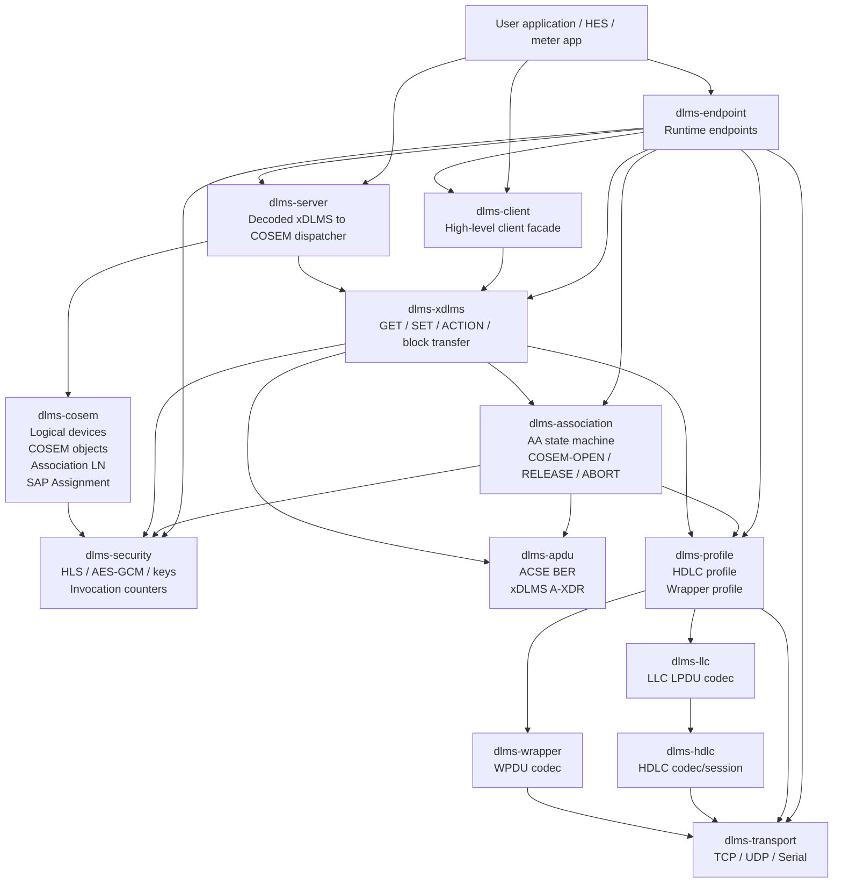

## 6. Layer Dependencies

Dependencies must point from higher-level orchestration toward lower-level
codecs and infrastructure. A lower layer must not include headers from a higher
layer.

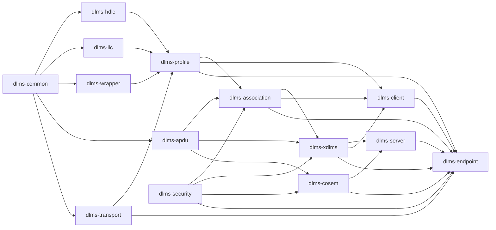

## 7. Layer Responsibilities

### 7.1 `dlms-common`

Provides shared infrastructure used by multiple repositories.

In scope:

- byte views;
- mutable byte views;
- common buffer readers and writers;
- common status-category helpers;
- endian helpers;
- shared limit structures only when they are protocol-neutral.

Out of scope:

- HDLC, LLC, Wrapper, APDU, Association, Security, or COSEM semantics.

Class interaction diagram:

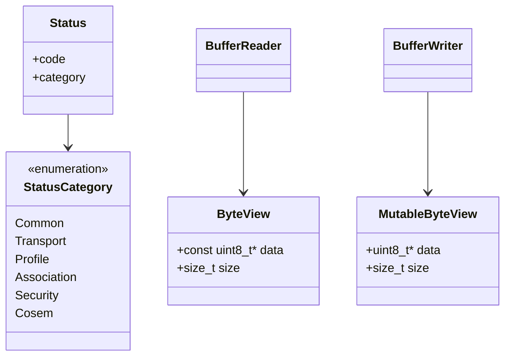

### 7.2 `dlms-transport`

Provides byte and datagram I/O without DLMS protocol awareness.

In scope:

- TCP stream transport;
- UDP datagram transport;
- serial stream transport;
- timer abstraction for future timeout/retry policies.

Out of scope:

- APDU framing;
- Wrapper decoding;
- HDLC session handling;
- DLMS association state.

Class interaction diagram:

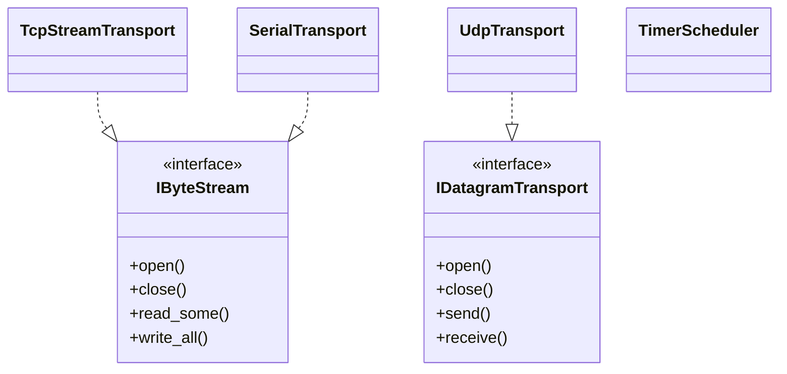

MVP success criteria:

- TCP client transport opens, reads, writes, and closes.
- Runtime errors are reported as status codes.
- Tests use fake or loopback transports without relying on live meters.

### 7.3 `dlms-profile`

Turns lower protocol codecs and transport interfaces into APDU channels.

In scope:

- Wrapper over TCP APDU channel;
- Wrapper over UDP APDU channel;
- HDLC + LLC APDU channel;
- APDU send/receive boundary.

Out of scope:

- ACSE parsing;
- xDLMS service decisions;
- Association state;
- security decisions.

Class interaction diagram:

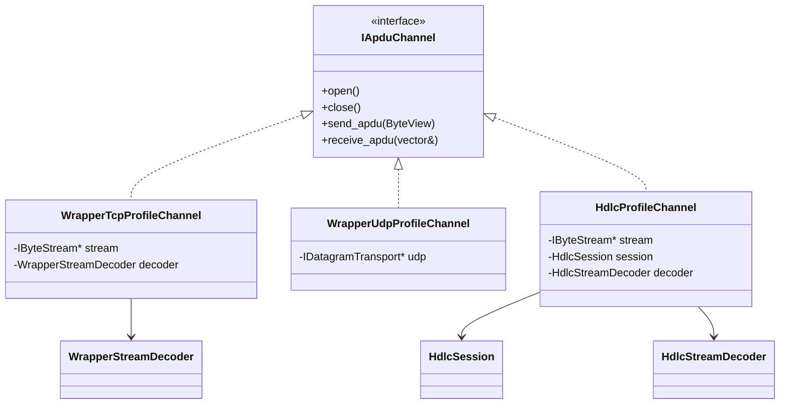

MVP success criteria:

- APDU bytes pass through Wrapper/TCP framing.
- APDU bytes pass through HDLC/LLC using a fake byte stream.
- `dlms-profile` does not inspect APDU contents.

### 7.4 `dlms-association`

Implements DLMS/COSEM Application Association orchestration.

In scope:

- COSEM-OPEN;
- COSEM-RELEASE;
- COSEM-ABORT;
- AARQ/AARE orchestration;
- application context negotiation;
- xDLMS conformance and max-PDU-size negotiation;
- association state machine.

Out of scope:

- actual transport I/O;
- GET/SET/ACTION object access;
- cryptographic algorithm implementation;
- COSEM object storage.

Class interaction diagram:

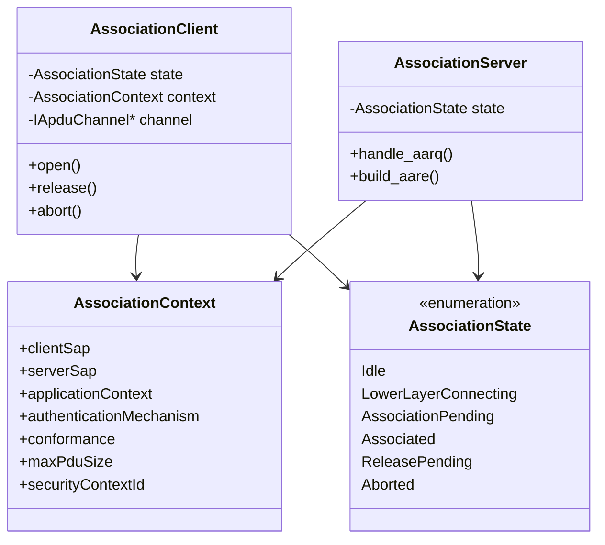

MVP success criteria:

- LN referencing.
- Public client.
- No-security authentication.
- AARQ with xDLMS InitiateRequest.
- AARE with xDLMS InitiateResponse.
- Clean rejection of unsupported contexts.

### 7.5 `dlms-xdlms`

Provides high-level xDLMS service orchestration over an established
association. The layer owns client request flows and the matching server-side
service dispatch boundary for GET, SET, ACTION, and block transfer.

In scope:

- client-side normal GET, SET, and ACTION;
- server-side GET, SET, and ACTION dispatch contracts;
- invoke-id and priority management for client flows;
- service-specific block transfer for GET, SET, and ACTION MVP paths.

Out of scope:

- association opening;
- lower-layer transport;
- COSEM object storage and method execution.

Class interaction diagram:

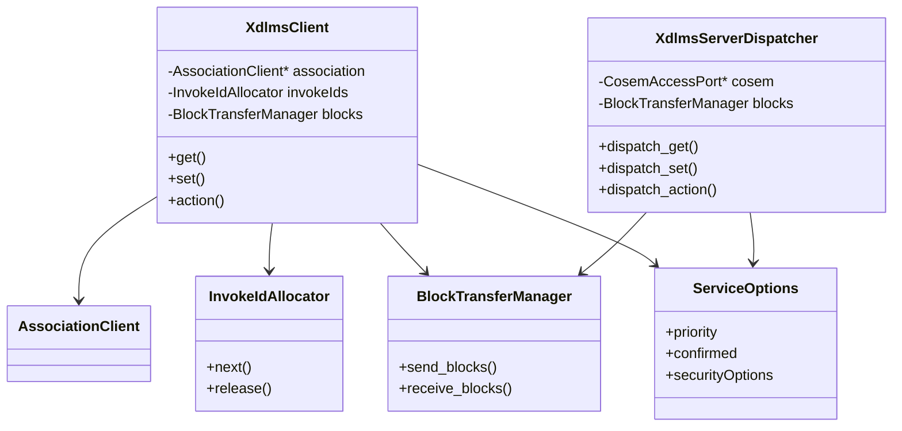

MVP success criteria:

- one outstanding confirmed request;
- normal GET request/response round trip;
- invoke-id validation;
- no block-transfer policy in v1.

### 7.6 `dlms-security`

Executes DLMS/COSEM application-layer security.

In scope:

- security context;
- security policy evaluation primitives;
- AES-GCM APDU protection and unprotection;
- invocation counter management interfaces;
- key-store interfaces;
- LLS/HLS authentication plumbing.

Out of scope:

- persistent key storage implementation;
- COSEM object registry;
- transport encryption;
- access-right ownership.

Class interaction diagram:

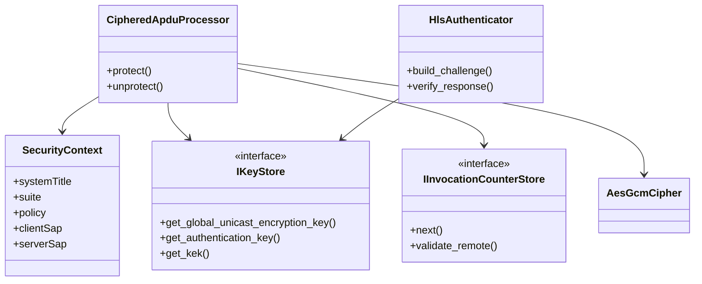

MVP success criteria:

- Suite 0 AES-GCM-128.
- Protect and unprotect service-specific or global ciphered xDLMS APDUs.
- Invocation counter monotonic policy.
- HLS GMAC after basic ciphering is stable.

### 7.7 `dlms-cosem`

Implements the COSEM object model and server resource registry.

In scope:

- physical device model;
- logical device model;
- COSEM object registry;
- attribute and method dispatch interfaces;
- Association LN view;
- SAP Assignment object;
- access-right modelling.

Out of scope:

- TCP/serial transport;
- HDLC/Wrapper framing;
- APDU byte encoding;
- server event loop.

Class interaction diagram:

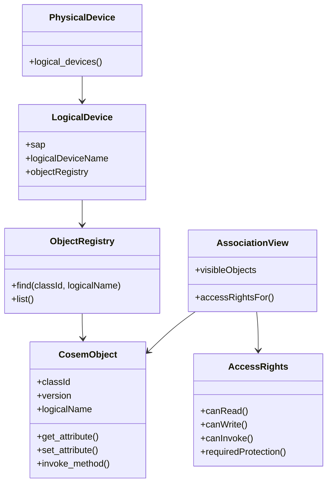

MVP success criteria:

- `Data` object.
- minimal `Association LN` object.
- minimal `SAP Assignment` object.
- logical device name object.
- read-only public association view.

### 7.8 `dlms-server`

Dispatches decoded xDLMS service indications to the COSEM object model.

In scope:

- GET/SET/ACTION dispatch;
- access-right checks;
- response value construction;
- xDLMS indication/result adapter.

Out of scope:

- low-level codec implementations;
- transport/profile lifecycle;
- server-side association loop;
- APDU receive/decode/dispatch loop;
- persistent object storage;
- cryptographic primitive implementation.

Class interaction diagram:

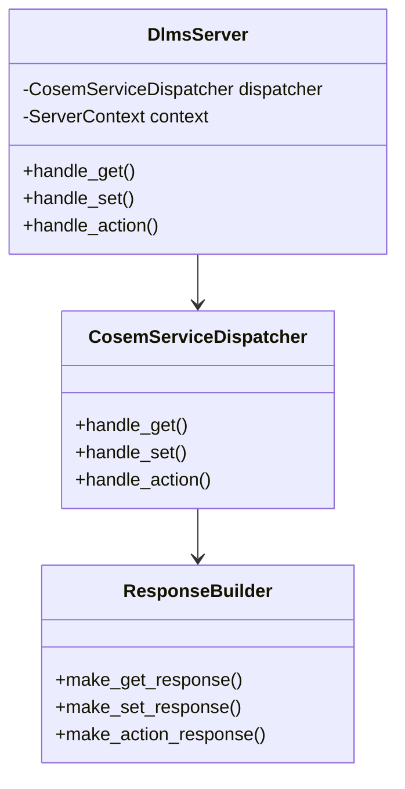

MVP success criteria:

- decoded GET for object list, logical device name, and a simple `Data` object;
- decoded SET and ACTION dispatch to registered COSEM objects;
- xDLMS adapter for server-side GET, SET, and ACTION indications.

### 7.9 `dlms-client`

Exposes an ergonomic client facade for applications.

In scope:

- profile creation from options;
- transport creation from options;
- association opening and release;
- high-level GET/SET/ACTION forwarding;
- simple synchronous API.

Out of scope:

- server-side object dispatch;
- application storage;
- custom scheduler ownership in v1.

Class interaction diagram:

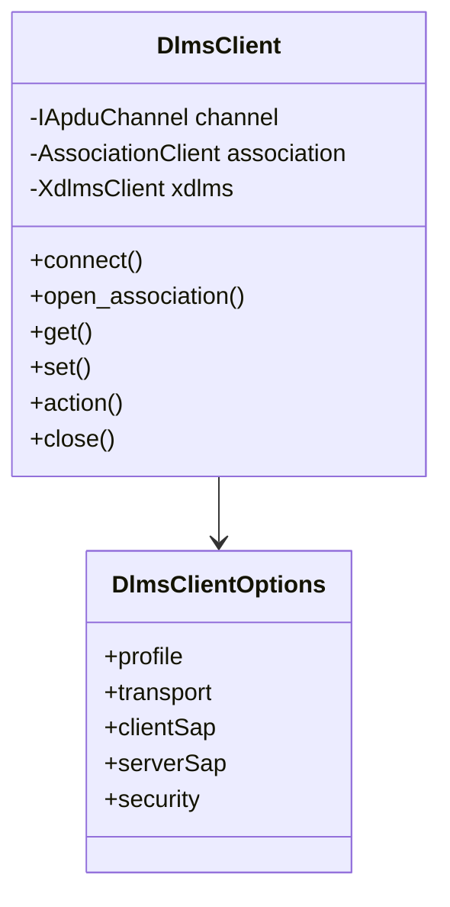

Target usage:

```cpp
DlmsClient client(options);
client.Connect();
client.OpenAssociation();
DlmsData value = client.Get(class_id, logical_name, attribute_id);
client.ReleaseAssociation();
client.Close();
```

### 7.10 `dlms-endpoint`

Composes existing framework layers into runtime endpoints.

In scope:

- client endpoint lifecycle;
- server endpoint lifecycle;
- push listener endpoint lifecycle;
- gateway endpoint lifecycle;
- construction and binding of transport, profile, association, security,
  xDLMS, client, server, and COSEM components.

Out of scope:

- protocol codecs;
- association negotiation rules;
- xDLMS service semantics;
- COSEM object behaviour;
- cryptographic primitive implementation;
- application-specific SPODES object sets.

Server-side AARQ/AARE is not an endpoint runtime responsibility yet. The
current association layer exposes client-side association flow; a lower-layer
server association processor must own AARQ decode, AARE encode, and xDLMS
context negotiation before endpoint listener runtimes compose that step.

Class interaction diagram:

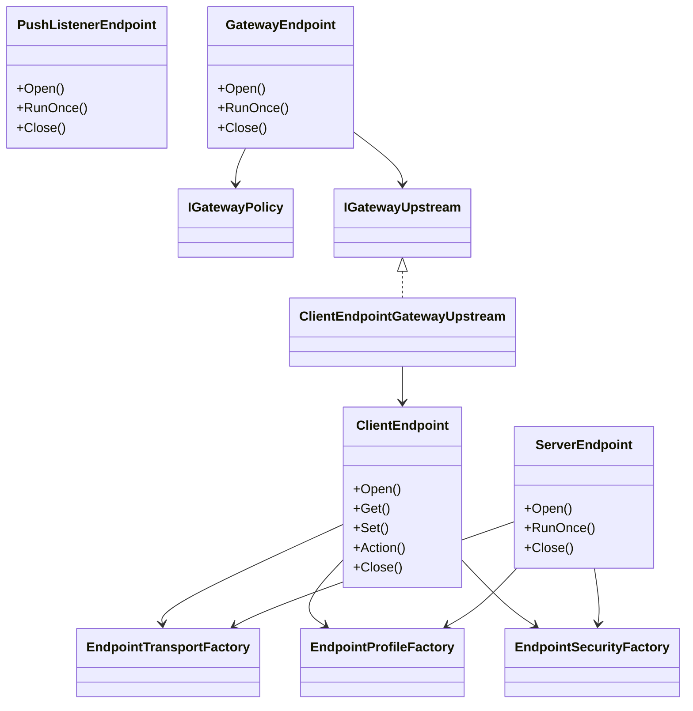

MVP success criteria:

- Wrapper/TCP client endpoint using `dlms-client`;
- server endpoint `RunOnce` over a fake APDU channel;
- TCP listener runtime accepts one Wrapper/TCP connection and serves bounded
  server GET, SET, and ACTION `RunOnce` paths;
- TCP listener runtime accepts one Wrapper/TCP connection, completes
  no-security AARQ/AARE association negotiation, and serves bounded GET, SET,
  and ACTION `RunOnce` paths;
- TCP listener runtime accepts one Wrapper/TCP connection, completes
  no-security AARQ/AARE association negotiation, and releases the association
  on a bounded RLRQ/RLRE `RunOnce` path;
- TCP listener runtime accepts one Wrapper/TCP connection, completes Low
  Password AARQ/AARE association negotiation, and serves a bounded GET
  `RunOnce` path;
- TCP listener runtime accepts one Wrapper/TCP connection, completes Low
  Password AARQ/AARE association negotiation, and serves bounded SET and
  ACTION `RunOnce` paths;
- TCP listener runtime accepts one Wrapper/TCP connection, completes Low
  Password AARQ/AARE association negotiation, and releases the association on a
  bounded RLRQ/RLRE `RunOnce` path;
- TCP listener runtime rejects a Wrapper/TCP Low Password AARQ with mismatched
  credentials before serving requests;
- TCP listener runtime accepts HDLC-over-TCP connections and serves bounded
  no-session server GET, SET, and ACTION `RunOnce` paths;
- TCP listener runtime accepts one HDLC-over-TCP no-session connection,
  completes no-security AARQ/AARE association negotiation, and serves bounded
  GET, SET, and ACTION `RunOnce` paths;
- TCP listener runtime accepts one HDLC-over-TCP no-session connection,
  completes no-security AARQ/AARE association negotiation, and releases the
  association on a bounded RLRQ/RLRE `RunOnce` path;
- TCP listener runtime accepts one HDLC-over-TCP no-session connection,
  completes Low Password AARQ/AARE association negotiation, and serves a
  bounded GET `RunOnce` path;
- TCP listener runtime accepts one HDLC-over-TCP no-session connection,
  completes Low Password AARQ/AARE association negotiation, and serves bounded
  SET and ACTION `RunOnce` paths;
- TCP listener runtime accepts one HDLC-over-TCP no-session connection,
  completes Low Password AARQ/AARE association negotiation, and releases the
  association on a bounded RLRQ/RLRE `RunOnce` path;
- TCP listener runtime rejects an HDLC-over-TCP no-session Low Password AARQ
  with mismatched credentials before serving requests;
- TCP listener runtime accepts HDLC-over-TCP connections, completes explicit
  SNRM/UA data-link setup, and serves bounded GET, SET, and ACTION `RunOnce`
  paths;
- TCP listener runtime accepts one HDLC-over-TCP explicit SNRM/UA connection,
  completes no-security AARQ/AARE association negotiation, and serves bounded
  GET, SET, and ACTION `RunOnce` paths;
- TCP listener runtime accepts one HDLC-over-TCP explicit SNRM/UA connection,
  completes no-security AARQ/AARE association negotiation, and releases the
  association on a bounded RLRQ/RLRE `RunOnce` path;
- TCP listener runtime accepts one HDLC-over-TCP explicit SNRM/UA connection,
  completes Low Password AARQ/AARE association negotiation, and serves a
  bounded GET `RunOnce` path;
- TCP listener runtime accepts one HDLC-over-TCP explicit SNRM/UA connection,
  completes Low Password AARQ/AARE association negotiation, and serves bounded
  SET and ACTION `RunOnce` paths;
- TCP listener runtime accepts one HDLC-over-TCP explicit SNRM/UA connection,
  completes Low Password AARQ/AARE association negotiation, and releases the
  association on a bounded RLRQ/RLRE `RunOnce` path;
- TCP listener runtime accepts one HDLC-over-TCP explicit SNRM/UA connection
  and rejects a Low Password AARQ with mismatched credentials before serving
  requests;
- push listener endpoint receives one APDU and calls user code;
- TCP push listener runtime accepts one Wrapper/TCP connection and dispatches
  one raw push APDU;
- TCP push listener runtime accepts one Wrapper/TCP connection, completes
  no-security AARQ/AARE association negotiation, and dispatches one raw push
  APDU;
- TCP push listener runtime accepts one Wrapper/TCP connection, completes Low
  Password AARQ/AARE association negotiation, and dispatches one raw push APDU;
- TCP push listener runtime rejects a Wrapper/TCP Low Password AARQ with
  mismatched credentials before dispatching push APDUs;
- TCP push listener runtime accepts one HDLC-over-TCP no-session connection and
  dispatches one raw push APDU;
- TCP push listener runtime accepts one HDLC-over-TCP no-session connection,
  completes no-security AARQ/AARE association negotiation, and dispatches one
  raw push APDU;
- TCP push listener runtime accepts one HDLC-over-TCP no-session connection,
  completes Low Password AARQ/AARE association negotiation, and dispatches one
  raw push APDU;
- TCP push listener runtime rejects an HDLC-over-TCP no-session Low Password
  AARQ with mismatched credentials before dispatching push APDUs;
- TCP push listener runtime accepts one HDLC-over-TCP explicit SNRM/UA
  connection and dispatches one raw push APDU;
- TCP push listener runtime accepts one HDLC-over-TCP explicit SNRM/UA
  connection, completes no-security AARQ/AARE association negotiation, and
  dispatches one raw push APDU;
- TCP push listener runtime accepts one HDLC-over-TCP explicit SNRM/UA
  connection, completes Low Password AARQ/AARE association negotiation, and
  dispatches one raw push APDU;
- TCP push listener runtime accepts one HDLC-over-TCP explicit SNRM/UA
  connection and rejects a Low Password AARQ with mismatched credentials before
  dispatching push APDUs;
- UDP push listener runtime receives one Wrapper/UDP datagram and dispatches
  one raw push APDU;
- gateway endpoint forwards an allowed GET upstream and returns the response;
- TCP gateway listener runtime accepts Wrapper/TCP downstream GET, SET, and
  ACTION requests and forwards them to an injected upstream.
- TCP gateway listener runtime accepts one Wrapper/TCP downstream connection,
  completes no-security AARQ/AARE association negotiation, and forwards a
  bounded GET, SET, and ACTION request to an injected upstream.
- TCP gateway listener runtime accepts one Wrapper/TCP downstream connection,
  completes no-security AARQ/AARE association negotiation, and releases the
  downstream association on a bounded RLRQ/RLRE request without invoking
  upstream services.
- TCP gateway listener runtime accepts one Wrapper/TCP downstream connection,
  completes Low Password AARQ/AARE association negotiation, and forwards a
  bounded GET request to an injected upstream.
- TCP gateway listener runtime accepts one Wrapper/TCP downstream connection,
  completes Low Password AARQ/AARE association negotiation, and forwards
  bounded SET and ACTION requests to an injected upstream.
- TCP gateway listener runtime accepts one Wrapper/TCP downstream connection,
  completes Low Password AARQ/AARE association negotiation, and releases the
  downstream association on a bounded RLRQ/RLRE request without invoking
  upstream services.
- TCP gateway listener runtime rejects a Wrapper/TCP Low Password AARQ with
  mismatched credentials before opening or invoking the injected upstream.
- TCP gateway listener runtime accepts HDLC-over-TCP no-session downstream GET,
  SET, and ACTION requests and forwards them to an injected upstream.
- TCP gateway listener runtime accepts one HDLC-over-TCP no-session downstream
  connection, completes no-security AARQ/AARE association negotiation, and
  forwards bounded GET, SET, and ACTION requests to an injected upstream.
- TCP gateway listener runtime accepts one HDLC-over-TCP no-session downstream
  connection, completes no-security AARQ/AARE association negotiation, and
  releases the downstream association on a bounded RLRQ/RLRE request without
  invoking upstream services.
- TCP gateway listener runtime accepts one HDLC-over-TCP no-session downstream
  connection, completes Low Password AARQ/AARE association negotiation, and
  forwards a bounded GET request to an injected upstream.
- TCP gateway listener runtime accepts one HDLC-over-TCP no-session downstream
  connection, completes Low Password AARQ/AARE association negotiation, and
  forwards bounded SET and ACTION requests to an injected upstream.
- TCP gateway listener runtime accepts one HDLC-over-TCP no-session downstream
  connection, completes Low Password AARQ/AARE association negotiation, and
  releases the downstream association on a bounded RLRQ/RLRE request without
  invoking upstream services.
- TCP gateway listener runtime rejects an HDLC-over-TCP no-session Low Password
  AARQ with mismatched credentials before opening or invoking the injected
  upstream.
- TCP gateway listener runtime accepts HDLC-over-TCP explicit SNRM/UA
  downstream GET, SET, and ACTION requests and forwards them to an injected
  upstream.
- TCP gateway listener runtime accepts one HDLC-over-TCP explicit SNRM/UA
  downstream connection, completes no-security AARQ/AARE association
  negotiation, and forwards bounded GET, SET, and ACTION requests to an
  injected upstream.
- TCP gateway listener runtime accepts one HDLC-over-TCP explicit SNRM/UA
  downstream connection, completes no-security AARQ/AARE association
  negotiation, and releases the downstream association on a bounded RLRQ/RLRE
  request without invoking upstream services.
- TCP gateway listener runtime accepts one HDLC-over-TCP explicit SNRM/UA
  downstream connection, completes Low Password AARQ/AARE association
  negotiation, and forwards a bounded GET request to an injected upstream.
- TCP gateway listener runtime accepts one HDLC-over-TCP explicit SNRM/UA
  downstream connection, completes Low Password AARQ/AARE association
  negotiation, and forwards bounded SET and ACTION requests to an injected
  upstream.
- TCP gateway listener runtime accepts one HDLC-over-TCP explicit SNRM/UA
  downstream connection, completes Low Password AARQ/AARE association
  negotiation, and releases the downstream association on a bounded RLRQ/RLRE
  request without invoking upstream services.
- TCP gateway listener runtime accepts one HDLC-over-TCP explicit SNRM/UA
  downstream connection and rejects a Low Password AARQ with mismatched
  credentials before opening or invoking the injected upstream.

## 8. Required Documentation Per Layer Repository

Each layer repository should include:

```text
README.md
docs/00_<layer>_requirements.md
docs/01_<layer>_api.md
docs/02_<layer>_c_api.md        optional, only when C ABI exists
docs/03_<layer>_test_plan.md
docs/architecture.md
```

Each `docs/architecture.md` should contain:

```text
1. Scope
2. In scope / out of scope
3. Dependencies
4. Public modules
5. Layer diagram
6. Class interaction diagrams per module
7. State machine, if applicable
8. Error model
9. Test strategy
```

For stateful layers, the architecture document must also include a state-machine
diagram. This applies at least to:

- `dlms-hdlc`;
- `dlms-profile`;
- `dlms-association`;
- `dlms-xdlms`;
- `dlms-server`.
- `dlms-endpoint`.

## 9. Implementation Order

The recommended order is:

1. Add or defer `dlms-common` based on actual duplication pressure.
2. Implement `dlms-transport` TCP stream MVP.
3. Implement `dlms-profile` Wrapper/TCP APDU channel MVP.
4. Implement `dlms-association` no-security LN client association.
5. Implement `dlms-xdlms` normal GET.
6. Add integration test: open association and perform GET over a fake or loopback Wrapper/TCP channel.
7. Implement `dlms-cosem` minimal object model.
8. Implement `dlms-server` minimal no-security server.
9. Implement `dlms-endpoint` runtime composition for client/server/push/gateway.
10. Implement HDLC profile orchestration in `dlms-profile`.
11. Implement `dlms-security` Suite 0 AES-GCM.
12. Complete server GET response block transfer.
13. Add richer COSEM interface classes and optional SN referencing.

This order prioritizes a working no-security LN client/server path before
cryptography and large object-model coverage. That keeps the implementation
testable while preserving the protocol boundaries required by DLMS/COSEM.

## 10. Initial Cross-Repository Acceptance Tests

The root repository should keep cross-layer tests that prove the layer contracts:

| Test | Layers |
|---|---|
| APDU survives LLC and HDLC boundaries | `dlms-apdu`, `dlms-llc`, `dlms-hdlc` |
| APDU survives Wrapper boundary | `dlms-apdu`, `dlms-wrapper` |
| Wrapper/TCP channel sends and receives APDU bytes | `dlms-profile`, `dlms-wrapper`, `dlms-transport` |
| No-security LN association opens | `dlms-association`, `dlms-apdu`, `dlms-profile` |
| Normal GET through client service | `dlms-xdlms`, `dlms-association`, `dlms-apdu` |
| Opt-in live public-client GET over Wrapper/TCP | `dlms-client`, `dlms-association`, `dlms-xdlms`, `dlms-profile`, `dlms-wrapper`, `dlms-transport` |

Live meter checks are not part of the default deterministic suite. They are
documented in `docs/live_meter_smoke_plan.md` and must require explicit endpoint
configuration before they run.
| Server GET APDU reaches COSEM object | `dlms-xdlms`, `dlms-server`, `dlms-cosem`, `dlms-apdu` |
| Server SET APDU writes COSEM object | `dlms-xdlms`, `dlms-server`, `dlms-cosem`, `dlms-apdu` |
| Server ACTION APDU invokes COSEM object | `dlms-xdlms`, `dlms-server`, `dlms-cosem`, `dlms-apdu` |
| Public-client GET against minimal server | `dlms-client`, `dlms-server`, `dlms-cosem`, `dlms-profile` |
| Ciphered GET round trip | `dlms-security`, `dlms-xdlms`, `dlms-server` |
| Server endpoint serves COSEM GET through profile channel | `dlms-endpoint`, `dlms-profile`, `dlms-xdlms`, `dlms-server`, `dlms-cosem` |
| TCP listener runtime serves Wrapper/TCP GET/SET/ACTION | `dlms-endpoint`, `dlms-transport`, `dlms-profile`, `dlms-xdlms`, `dlms-server`, `dlms-cosem` |
| TCP listener runtime serves Wrapper/TCP AARQ/AARE then GET/SET/ACTION | `dlms-endpoint`, `dlms-association`, `dlms-apdu`, `dlms-transport`, `dlms-profile`, `dlms-xdlms`, `dlms-server`, `dlms-cosem` |
| TCP listener runtime serves Wrapper/TCP AARQ/AARE then RLRQ/RLRE release | `dlms-endpoint`, `dlms-association`, `dlms-apdu`, `dlms-transport`, `dlms-profile` |
| TCP listener runtime serves Wrapper/TCP Low Password AARQ/AARE then GET | `dlms-endpoint`, `dlms-association`, `dlms-apdu`, `dlms-transport`, `dlms-profile`, `dlms-xdlms`, `dlms-server`, `dlms-cosem` |
| TCP listener runtime serves Wrapper/TCP Low Password AARQ/AARE then SET/ACTION | `dlms-endpoint`, `dlms-association`, `dlms-apdu`, `dlms-transport`, `dlms-profile`, `dlms-xdlms`, `dlms-server`, `dlms-cosem` |
| TCP listener runtime serves Wrapper/TCP Low Password AARQ/AARE then RLRQ/RLRE release | `dlms-endpoint`, `dlms-association`, `dlms-apdu`, `dlms-transport`, `dlms-profile` |
| TCP listener runtime rejects Wrapper/TCP Low Password credential mismatch | `dlms-endpoint`, `dlms-association`, `dlms-apdu`, `dlms-transport`, `dlms-profile` |
| TCP listener runtime serves HDLC-over-TCP no-session GET/SET/ACTION | `dlms-endpoint`, `dlms-transport`, `dlms-profile`, `dlms-hdlc`, `dlms-llc`, `dlms-xdlms`, `dlms-server`, `dlms-cosem` |
| TCP listener runtime serves HDLC-over-TCP no-session AARQ/AARE then GET/SET/ACTION | `dlms-endpoint`, `dlms-association`, `dlms-apdu`, `dlms-transport`, `dlms-profile`, `dlms-hdlc`, `dlms-llc`, `dlms-xdlms`, `dlms-server`, `dlms-cosem` |
| TCP listener runtime serves HDLC-over-TCP no-session AARQ/AARE then RLRQ/RLRE release | `dlms-endpoint`, `dlms-association`, `dlms-apdu`, `dlms-transport`, `dlms-profile`, `dlms-hdlc`, `dlms-llc` |
| TCP listener runtime serves HDLC-over-TCP no-session Low Password AARQ/AARE then GET | `dlms-endpoint`, `dlms-association`, `dlms-apdu`, `dlms-transport`, `dlms-profile`, `dlms-hdlc`, `dlms-llc`, `dlms-xdlms`, `dlms-server`, `dlms-cosem` |
| TCP listener runtime serves HDLC-over-TCP no-session Low Password AARQ/AARE then SET/ACTION | `dlms-endpoint`, `dlms-association`, `dlms-apdu`, `dlms-transport`, `dlms-profile`, `dlms-hdlc`, `dlms-llc`, `dlms-xdlms`, `dlms-server`, `dlms-cosem` |
| TCP listener runtime serves HDLC-over-TCP no-session Low Password AARQ/AARE then RLRQ/RLRE release | `dlms-endpoint`, `dlms-association`, `dlms-apdu`, `dlms-transport`, `dlms-profile`, `dlms-hdlc`, `dlms-llc` |
| TCP listener runtime rejects HDLC-over-TCP no-session Low Password credential mismatch | `dlms-endpoint`, `dlms-association`, `dlms-apdu`, `dlms-transport`, `dlms-profile`, `dlms-hdlc`, `dlms-llc` |
| TCP listener runtime serves HDLC-over-TCP explicit SNRM/UA session GET/SET/ACTION | `dlms-endpoint`, `dlms-transport`, `dlms-profile`, `dlms-hdlc`, `dlms-llc`, `dlms-xdlms`, `dlms-server`, `dlms-cosem` |
| TCP listener runtime serves HDLC-over-TCP explicit SNRM/UA session AARQ/AARE then GET/SET/ACTION | `dlms-endpoint`, `dlms-association`, `dlms-apdu`, `dlms-transport`, `dlms-profile`, `dlms-hdlc`, `dlms-llc`, `dlms-xdlms`, `dlms-server`, `dlms-cosem` |
| TCP listener runtime serves HDLC-over-TCP explicit SNRM/UA session AARQ/AARE then RLRQ/RLRE release | `dlms-endpoint`, `dlms-association`, `dlms-apdu`, `dlms-transport`, `dlms-profile`, `dlms-hdlc`, `dlms-llc` |
| TCP listener runtime serves HDLC-over-TCP explicit SNRM/UA session Low Password AARQ/AARE then GET | `dlms-endpoint`, `dlms-association`, `dlms-apdu`, `dlms-transport`, `dlms-profile`, `dlms-hdlc`, `dlms-llc`, `dlms-xdlms`, `dlms-server`, `dlms-cosem` |
| TCP listener runtime serves HDLC-over-TCP explicit SNRM/UA session Low Password AARQ/AARE then SET/ACTION | `dlms-endpoint`, `dlms-association`, `dlms-apdu`, `dlms-transport`, `dlms-profile`, `dlms-hdlc`, `dlms-llc`, `dlms-xdlms`, `dlms-server`, `dlms-cosem` |
| TCP listener runtime serves HDLC-over-TCP explicit SNRM/UA session Low Password AARQ/AARE then RLRQ/RLRE release | `dlms-endpoint`, `dlms-association`, `dlms-apdu`, `dlms-transport`, `dlms-profile`, `dlms-hdlc`, `dlms-llc` |
| TCP listener runtime rejects HDLC-over-TCP explicit SNRM/UA session Low Password credential mismatch | `dlms-endpoint`, `dlms-association`, `dlms-apdu`, `dlms-transport`, `dlms-profile`, `dlms-hdlc`, `dlms-llc` |
| Push listener endpoint dispatches raw push APDU | `dlms-endpoint`, `dlms-profile` |
| TCP push listener runtime dispatches one Wrapper/TCP APDU | `dlms-endpoint`, `dlms-transport`, `dlms-profile` |
| TCP push listener runtime dispatches one Wrapper/TCP AARQ/AARE then APDU | `dlms-endpoint`, `dlms-association`, `dlms-apdu`, `dlms-transport`, `dlms-profile` |
| TCP push listener runtime dispatches one Wrapper/TCP Low Password AARQ/AARE then APDU | `dlms-endpoint`, `dlms-association`, `dlms-apdu`, `dlms-transport`, `dlms-profile` |
| TCP push listener runtime rejects Wrapper/TCP Low Password credential mismatch | `dlms-endpoint`, `dlms-association`, `dlms-apdu`, `dlms-transport`, `dlms-profile` |
| TCP push listener runtime dispatches one HDLC-over-TCP no-session APDU | `dlms-endpoint`, `dlms-transport`, `dlms-profile`, `dlms-hdlc`, `dlms-llc` |
| TCP push listener runtime dispatches one HDLC-over-TCP no-session AARQ/AARE then APDU | `dlms-endpoint`, `dlms-association`, `dlms-apdu`, `dlms-transport`, `dlms-profile`, `dlms-hdlc`, `dlms-llc` |
| TCP push listener runtime dispatches one HDLC-over-TCP no-session Low Password AARQ/AARE then APDU | `dlms-endpoint`, `dlms-association`, `dlms-apdu`, `dlms-transport`, `dlms-profile`, `dlms-hdlc`, `dlms-llc` |
| TCP push listener runtime rejects HDLC-over-TCP no-session Low Password credential mismatch | `dlms-endpoint`, `dlms-association`, `dlms-apdu`, `dlms-transport`, `dlms-profile`, `dlms-hdlc`, `dlms-llc` |
| TCP push listener runtime dispatches one HDLC-over-TCP explicit SNRM/UA session APDU | `dlms-endpoint`, `dlms-transport`, `dlms-profile`, `dlms-hdlc`, `dlms-llc` |
| TCP push listener runtime dispatches one HDLC-over-TCP explicit SNRM/UA session AARQ/AARE then APDU | `dlms-endpoint`, `dlms-association`, `dlms-apdu`, `dlms-transport`, `dlms-profile`, `dlms-hdlc`, `dlms-llc` |
| TCP push listener runtime dispatches one HDLC-over-TCP explicit SNRM/UA session Low Password AARQ/AARE then APDU | `dlms-endpoint`, `dlms-association`, `dlms-apdu`, `dlms-transport`, `dlms-profile`, `dlms-hdlc`, `dlms-llc` |
| TCP push listener runtime rejects HDLC-over-TCP explicit SNRM/UA session Low Password credential mismatch | `dlms-endpoint`, `dlms-association`, `dlms-apdu`, `dlms-transport`, `dlms-profile`, `dlms-hdlc`, `dlms-llc` |
| UDP push listener runtime dispatches one Wrapper/UDP datagram APDU | `dlms-endpoint`, `dlms-transport`, `dlms-profile` |
| Gateway endpoint forwards GET to injected upstream | `dlms-endpoint`, `dlms-profile`, `dlms-xdlms` |
| TCP gateway listener runtime forwards Wrapper/TCP GET/SET/ACTION | `dlms-endpoint`, `dlms-transport`, `dlms-profile`, `dlms-xdlms` |
| TCP gateway listener runtime forwards Wrapper/TCP AARQ/AARE then GET/SET/ACTION | `dlms-endpoint`, `dlms-association`, `dlms-apdu`, `dlms-transport`, `dlms-profile`, `dlms-xdlms` |
| TCP gateway listener runtime releases Wrapper/TCP AARQ/AARE then RLRQ/RLRE without upstream service invocation | `dlms-endpoint`, `dlms-association`, `dlms-apdu`, `dlms-transport`, `dlms-profile` |
| TCP gateway listener runtime forwards Wrapper/TCP Low Password AARQ/AARE then GET | `dlms-endpoint`, `dlms-association`, `dlms-apdu`, `dlms-transport`, `dlms-profile`, `dlms-xdlms` |
| TCP gateway listener runtime forwards Wrapper/TCP Low Password AARQ/AARE then SET/ACTION | `dlms-endpoint`, `dlms-association`, `dlms-apdu`, `dlms-transport`, `dlms-profile`, `dlms-xdlms` |
| TCP gateway listener runtime releases Wrapper/TCP Low Password AARQ/AARE then RLRQ/RLRE without upstream service invocation | `dlms-endpoint`, `dlms-association`, `dlms-apdu`, `dlms-transport`, `dlms-profile` |
| TCP gateway listener runtime rejects Wrapper/TCP Low Password credential mismatch | `dlms-endpoint`, `dlms-association`, `dlms-apdu`, `dlms-transport`, `dlms-profile` |
| TCP gateway listener runtime forwards HDLC-over-TCP no-session GET/SET/ACTION | `dlms-endpoint`, `dlms-transport`, `dlms-profile`, `dlms-hdlc`, `dlms-llc`, `dlms-xdlms` |
| TCP gateway listener runtime forwards HDLC-over-TCP no-session AARQ/AARE then GET/SET/ACTION | `dlms-endpoint`, `dlms-association`, `dlms-apdu`, `dlms-transport`, `dlms-profile`, `dlms-hdlc`, `dlms-llc`, `dlms-xdlms` |
| TCP gateway listener runtime releases HDLC-over-TCP no-session AARQ/AARE then RLRQ/RLRE without upstream service invocation | `dlms-endpoint`, `dlms-association`, `dlms-apdu`, `dlms-transport`, `dlms-profile`, `dlms-hdlc`, `dlms-llc` |
| TCP gateway listener runtime forwards HDLC-over-TCP no-session Low Password AARQ/AARE then GET | `dlms-endpoint`, `dlms-association`, `dlms-apdu`, `dlms-transport`, `dlms-profile`, `dlms-hdlc`, `dlms-llc`, `dlms-xdlms` |
| TCP gateway listener runtime forwards HDLC-over-TCP no-session Low Password AARQ/AARE then SET/ACTION | `dlms-endpoint`, `dlms-association`, `dlms-apdu`, `dlms-transport`, `dlms-profile`, `dlms-hdlc`, `dlms-llc`, `dlms-xdlms` |
| TCP gateway listener runtime releases HDLC-over-TCP no-session Low Password AARQ/AARE then RLRQ/RLRE without upstream service invocation | `dlms-endpoint`, `dlms-association`, `dlms-apdu`, `dlms-transport`, `dlms-profile`, `dlms-hdlc`, `dlms-llc` |
| TCP gateway listener runtime rejects HDLC-over-TCP no-session Low Password credential mismatch | `dlms-endpoint`, `dlms-association`, `dlms-apdu`, `dlms-transport`, `dlms-profile`, `dlms-hdlc`, `dlms-llc` |
| TCP gateway listener runtime forwards HDLC-over-TCP explicit SNRM/UA session GET/SET/ACTION | `dlms-endpoint`, `dlms-transport`, `dlms-profile`, `dlms-hdlc`, `dlms-llc`, `dlms-xdlms` |
| TCP gateway listener runtime forwards HDLC-over-TCP explicit SNRM/UA session AARQ/AARE then GET/SET/ACTION | `dlms-endpoint`, `dlms-association`, `dlms-apdu`, `dlms-transport`, `dlms-profile`, `dlms-hdlc`, `dlms-llc`, `dlms-xdlms` |
| TCP gateway listener runtime releases HDLC-over-TCP explicit SNRM/UA session AARQ/AARE then RLRQ/RLRE without upstream service invocation | `dlms-endpoint`, `dlms-association`, `dlms-apdu`, `dlms-transport`, `dlms-profile`, `dlms-hdlc`, `dlms-llc` |
| TCP gateway listener runtime forwards HDLC-over-TCP explicit SNRM/UA session Low Password AARQ/AARE then GET | `dlms-endpoint`, `dlms-association`, `dlms-apdu`, `dlms-transport`, `dlms-profile`, `dlms-hdlc`, `dlms-llc`, `dlms-xdlms` |
| TCP gateway listener runtime forwards HDLC-over-TCP explicit SNRM/UA session Low Password AARQ/AARE then SET/ACTION | `dlms-endpoint`, `dlms-association`, `dlms-apdu`, `dlms-transport`, `dlms-profile`, `dlms-hdlc`, `dlms-llc`, `dlms-xdlms` |
| TCP gateway listener runtime releases HDLC-over-TCP explicit SNRM/UA session Low Password AARQ/AARE then RLRQ/RLRE without upstream service invocation | `dlms-endpoint`, `dlms-association`, `dlms-apdu`, `dlms-transport`, `dlms-profile`, `dlms-hdlc`, `dlms-llc` |
| TCP gateway listener runtime rejects HDLC-over-TCP explicit SNRM/UA session Low Password credential mismatch | `dlms-endpoint`, `dlms-association`, `dlms-apdu`, `dlms-transport`, `dlms-profile`, `dlms-hdlc`, `dlms-llc` |

The root tests should validate integration only. Unit coverage for each layer
belongs in that layer's own repository.
