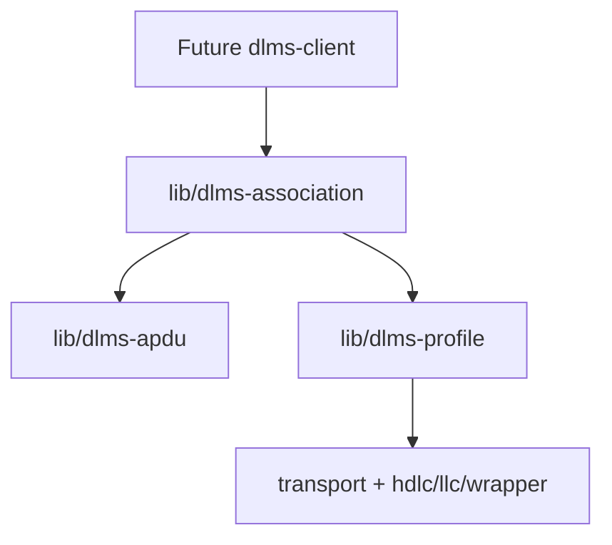
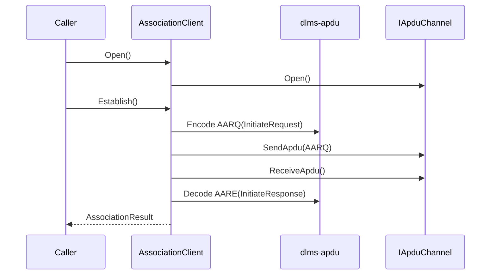
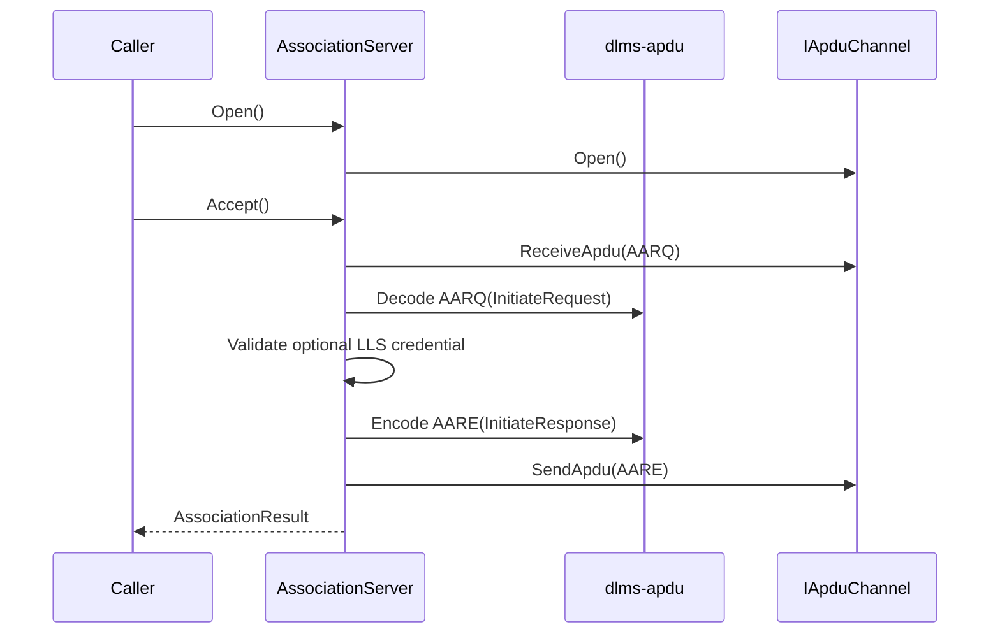
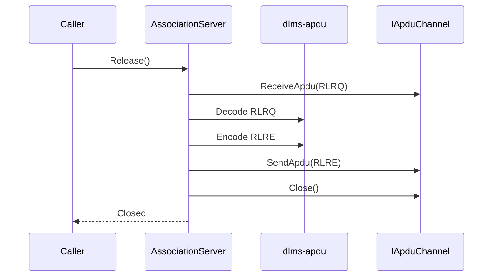
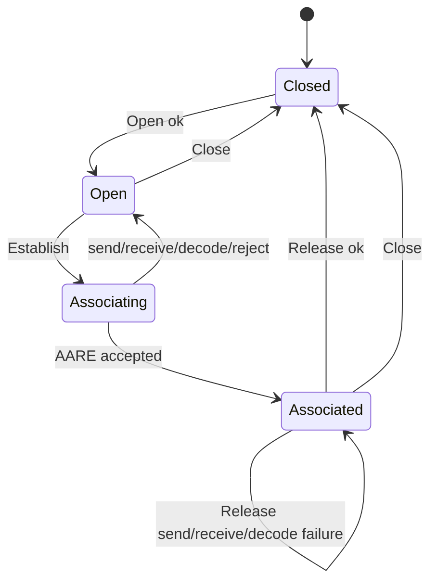
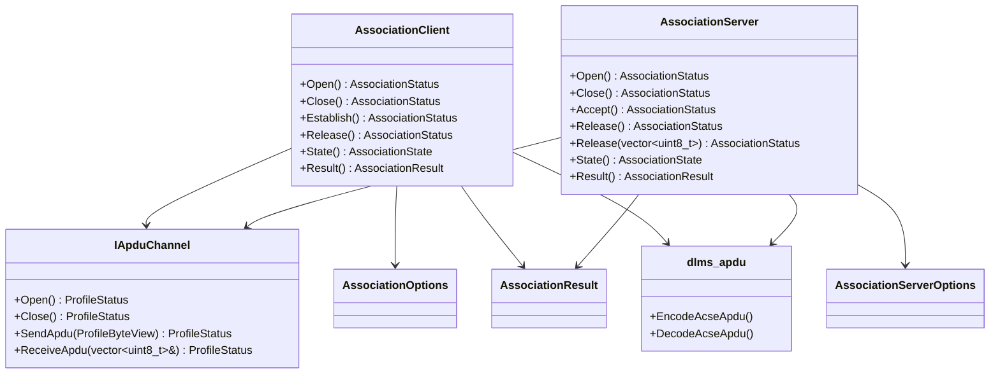
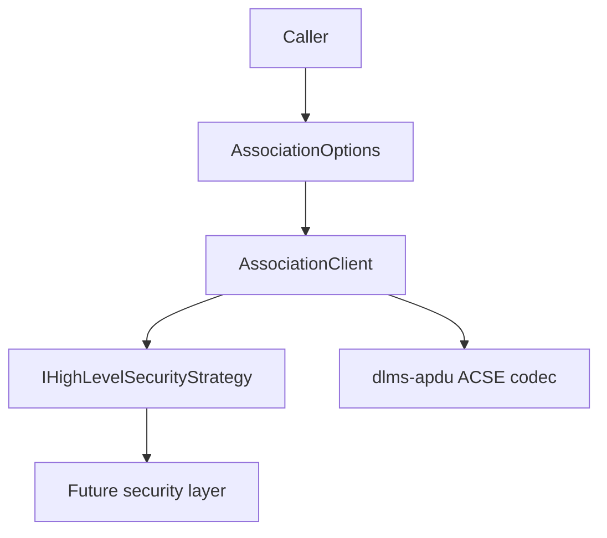
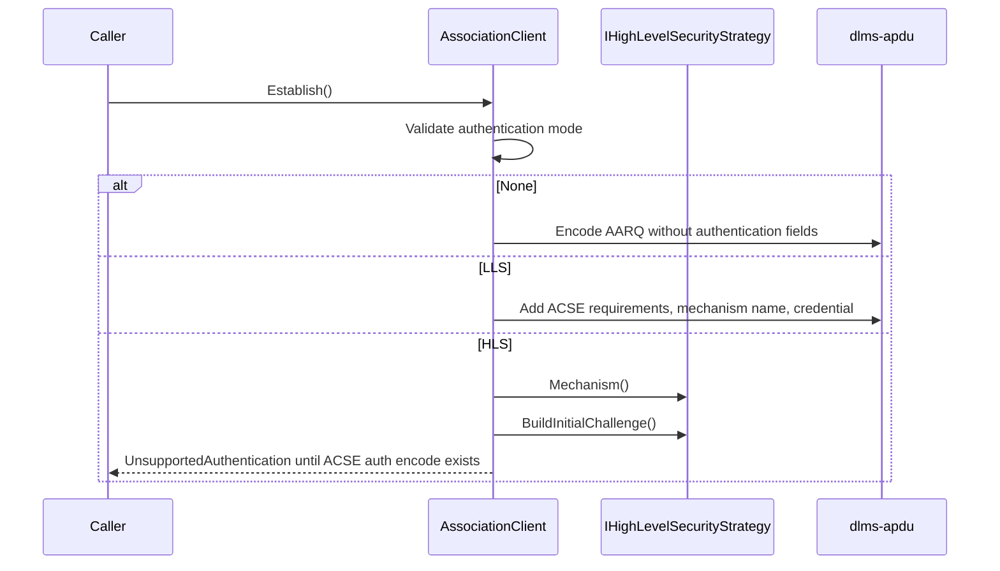

# dlms-association Architecture

## 1. Layer Position

## 2. Open Handshake

## 3. Server Accept Handshake

The server processor owns only ACSE association negotiation. It exposes the
negotiated xDLMS context for higher-layer composition and deliberately does not
dispatch COSEM objects, run endpoint listeners, or manage background loops.

## 4. Server Release Handshake

Failed server release receive, decode, send, or close operations leave the
server associated so the caller can still fall back to `Close()`.
Endpoint-style callers that have already received the next APDU may call the
overload that accepts the RLRQ bytes; it skips only the receive step.

## 5. State Machine

`AssociationServer` uses the same state names. `Accept()` moves
`Open -> Associating -> Associated` on a successful AARQ/AARE exchange and
returns to `Open` on receive, decode, negotiation, or send failure.
`Release()` moves `Associated -> Closed` on a successful RLRQ/RLRE exchange and
leaves the server `Associated` on receive, decode, send, or close failure.

## 6. Class Interaction

## 7. Ownership

`AssociationClient` and `AssociationServer` store references to
`dlms::profile::IApduChannel`. They do not own the channel and do not own
transport resources directly.

## 8. Authentication Boundary

`dlms-association` owns only the association state machine, option validation,
raw LLS ACSE authentication field selection, and server-side Low Password byte
comparison. HLS challenge functions, ciphering, keys, and invocation counters
remain delegated to future client and security composition.
