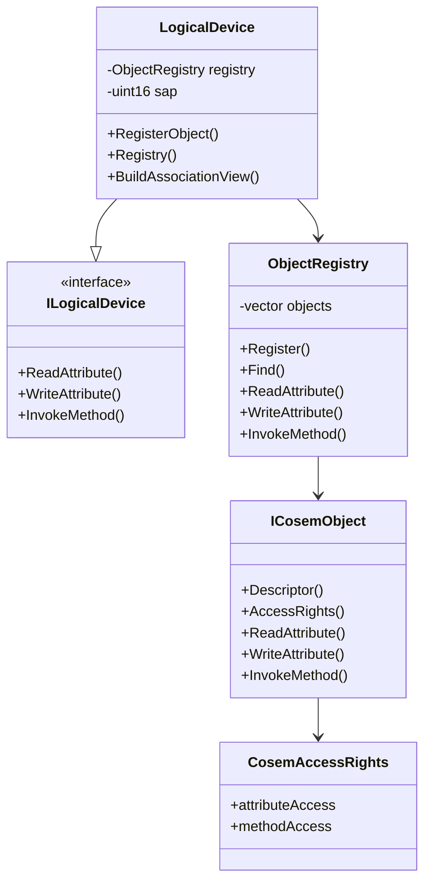

# dlms-cosem API

## 1. Public Headers

Planned phase 1 headers:

```text
include/dlms/cosem/cosem_status.hpp
include/dlms/cosem/cosem_types.hpp
include/dlms/cosem/cosem_object.hpp
include/dlms/cosem/object_registry.hpp
include/dlms/cosem/logical_device_interface.hpp
include/dlms/cosem/logical_device.hpp
include/dlms/cosem/simple_objects.hpp
```

No C ABI is planned for the first implementation.

## 2. Status

`CosemStatus` shall be a stable status contract:

- `Ok`
- `InvalidArgument`
- `DuplicateObject`
- `ObjectNotFound`
- `AttributeNotFound`
- `MethodNotFound`
- `AccessDenied`
- `OutputBufferTooSmall`
- `UnsupportedFeature`
- `ObjectError`
- `InternalError`

## 3. Types

`CosemLogicalName` is a six-byte logical-name value.

`CosemObjectKey` contains:

- `classId`
- `logicalName`

`CosemObjectDescriptor` contains:

- `classId`
- `version`
- `logicalName`

`CosemAttributeDescriptor` contains:

- `object`
- `attributeId`

`CosemMethodDescriptor` contains:

- `object`
- `methodId`

`CosemByteBuffer` is the first-phase encoded xDLMS data container.

## 4. Access Rights

`AttributeAccessMode`:

- `NoAccess`
- `ReadOnly`
- `WriteOnly`
- `ReadAndWrite`
- `AuthenticatedReadOnly`
- `AuthenticatedWriteOnly`
- `AuthenticatedReadAndWrite`

`MethodAccessMode`:

- `NoAccess`
- `Access`
- `AuthenticatedAccess`

`CosemAccessRights` contains attribute and method access entries for one
object. The first implementation stores explicit entries only; missing entries
mean no access.

## 5. Object Interface

```cpp
class ICosemObject
{
public:
  virtual ~ICosemObject();
  virtual CosemObjectDescriptor Descriptor() const = 0;
  virtual CosemAccessRights AccessRights() const = 0;
  virtual CosemStatus ReadAttribute(
    std::uint8_t attributeId,
    CosemByteBuffer& output) const = 0;
  virtual CosemStatus WriteAttribute(
    std::uint8_t attributeId,
    const CosemByteBuffer& input) = 0;
  virtual CosemStatus InvokeMethod(
    std::uint8_t methodId,
    const CosemByteBuffer& input,
    CosemByteBuffer& output) = 0;
};
```

## 6. Registry API

```cpp
ObjectRegistry registry;
registry.Register(object);

const ICosemObject* object = registry.Find(key);
registry.ReadAttribute(attribute, output);
registry.WriteAttribute(attribute, input);
registry.InvokeMethod(method, input, output);
registry.BuildAssociationView(view);
```

## 7. Logical Device Interface

`ILogicalDevice` is the abstract server dispatch boundary for applications
that own their COSEM storage outside the default in-memory `LogicalDevice`:

```cpp
class ILogicalDevice
{
public:
  virtual ~ILogicalDevice();

  virtual CosemStatus ReadAttribute(
    const CosemAttributeDescriptor& descriptor,
    const CosemAccessContext& context,
    CosemByteBuffer& output) const = 0;
  virtual CosemStatus WriteAttribute(
    const CosemAttributeDescriptor& descriptor,
    const CosemAccessContext& context,
    const CosemByteBuffer& input) = 0;
  virtual CosemStatus InvokeMethod(
    const CosemMethodDescriptor& descriptor,
    const CosemAccessContext& context,
    const CosemByteBuffer& input,
    CosemByteBuffer& output) = 0;
};
```

`ILogicalDevice` lives in `logical_device_interface.hpp`. Applications that
only implement custom COSEM storage can include that interface header without
including the default logical/physical device declarations. `LogicalDevice`
lives in `logical_device.hpp`, is the default implementation over
`ObjectRegistry`, and implements `ILogicalDevice`.

## 8. Module Diagram



## 9. Simple Interface Objects

`simple_objects.hpp` adds reusable in-memory implementations for the first
concrete COSEM interface classes:

```cpp
class CosemDataObject : public ICosemObject
{
public:
  CosemDataObject(
    const CosemLogicalName& logicalName,
    const CosemByteBuffer& value,
    AttributeAccessMode valueAccess);

  const CosemByteBuffer& Value() const;
  void SetValue(const CosemByteBuffer& value);
};

class CosemRegisterObject : public ICosemObject
{
public:
  CosemRegisterObject(
    const CosemLogicalName& logicalName,
    const CosemByteBuffer& value,
    const CosemByteBuffer& scalerUnit,
    AttributeAccessMode valueAccess);

  const CosemByteBuffer& Value() const;
  const CosemByteBuffer& ScalerUnit() const;
  void SetValue(const CosemByteBuffer& value);
  void SetScalerUnit(const CosemByteBuffer& scalerUnit);
};

class CosemClockObject : public ICosemObject
{
public:
  CosemClockObject(
    const CosemLogicalName& logicalName,
    const CosemByteBuffer& time,
    std::int16_t timeZone,
    std::uint8_t status,
    const CosemByteBuffer& daylightSavingsBegin,
    const CosemByteBuffer& daylightSavingsEnd,
    std::int8_t daylightSavingsDeviation,
    bool daylightSavingsEnabled,
    CosemClockBase clockBase);
};
```

The constructors create descriptors with class ids `1`, `3`, and `8`, version `0`.
Attribute `1` is read-only logical name. Attribute `2` is the value. Register
attribute `3` is read-only scaler-unit. Methods are not supported in this
increment.

Clock attribute `2`, `5`, and `6` are DLMS Data `octet-string` values
formatted as 12-byte DLMS date-time octets, as defined by the Clock IC. This is
different from the generic DLMS Data `date-time` tag. Clock methods
`adjust_to_quarter`, `adjust_to_measuring_period`, `adjust_to_minute`,
`adjust_to_preset_time`, `preset_adjusting_time`, and `shift_time` are exposed
in access rights but return `UnsupportedFeature` until a time-adjustment policy
is added.

`simple_objects.hpp` also exposes a partial Profile Generic IC `7` object and
class-level helpers for its current composite attributes:

```cpp
CosemByteBuffer EncodeProfileGenericCaptureObject(
  const CosemCaptureObject& object);
CosemStatus DecodeProfileGenericCaptureObject(
  const CosemByteBuffer& input,
  CosemCaptureObject& object);
CosemByteBuffer EncodeProfileGenericCaptureObjects(
  const std::vector<CosemCaptureObject>& objects);
CosemStatus DecodeProfileGenericCaptureObjects(
  const CosemByteBuffer& input,
  std::vector<CosemCaptureObject>& objects);
CosemByteBuffer EncodeProfileGenericBuffer(
  const std::vector<CosemByteBuffer>& rows);
CosemStatus DecodeProfileGenericBuffer(
  const CosemByteBuffer& input,
  std::vector<CosemByteBuffer>& rows);
std::uint8_t ProfileGenericRangeAccessSelector();
std::uint8_t ProfileGenericEntryAccessSelector();
CosemByteBuffer EncodeProfileGenericRangeDescriptor(
  const CosemProfileGenericRangeDescriptor& descriptor);
CosemStatus DecodeProfileGenericRangeDescriptor(
  const CosemByteBuffer& input,
  CosemProfileGenericRangeDescriptor& descriptor);
CosemByteBuffer EncodeProfileGenericEntryDescriptor(
  const CosemProfileGenericEntryDescriptor& descriptor);
CosemStatus DecodeProfileGenericEntryDescriptor(
  const CosemByteBuffer& input,
  CosemProfileGenericEntryDescriptor& descriptor);
```

`CosemCaptureObject` follows the Profile Generic
`capture_object_definition` structure order from the knowledge base:
`class_id`, `logical_name`, `attribute_index`, `data_index`. The buffer helpers
encode and decode the top-level `array`; each decoded row is validated as a
DLMS Data `structure` and returned as its original encoded bytes because row
field types are defined by the matching `capture_objects` schema.

Selective access helpers build the `buffer` access parameters documented for
Profile Generic:

- selector `1` uses `CosemProfileGenericRangeDescriptor`, encoded as
  `restricting_object`, `from_value`, `to_value`, and `selected_values`;
- selector `2` uses `CosemProfileGenericEntryDescriptor`, encoded as
  `from_entry`, `to_entry`, `from_selected_value`, and `to_selected_value`.

Range descriptor boundary values are stored as encoded simple DLMS Data bytes.
The decoder validates the allowed simple data tags, including `date-time`,
`date`, and `time`, but keeps the exact encoded value for the caller.

The same header also adds minimal discovery objects:

```cpp
class CosemAssociationLnObject : public ICosemObject
{
public:
  CosemAssociationLnObject(
    const CosemLogicalName& logicalName,
    const AssociationView& objectList);
};

class CosemSapAssignmentObject : public ICosemObject
{
public:
  CosemSapAssignmentObject(
    const CosemLogicalName& logicalName,
    const std::vector<SapAssignment>& assignments);
};

CosemLogicalName CurrentAssociationLnName();
CosemLogicalName SapAssignmentName();
CosemLogicalName LogicalDeviceNameObjectName();
CosemByteBuffer EncodeAssociationAccessRights(
  const CosemAccessRights& rights);
CosemStatus DecodeAssociationAccessRights(
  const CosemByteBuffer& input,
  CosemAccessRights& rights);
CosemByteBuffer EncodeAssociationObjectList(
  const AssociationView& objectList);
CosemStatus DecodeAssociationObjectList(
  const CosemByteBuffer& input,
  AssociationView& objectList);

enum class CosemAssociationStatus
{
  NonAssociated = 0,
  AssociationPending = 1,
  Associated = 2
};
```

Association LN exposes read-only attributes `1`, `2`, and `8`. Attribute `8`
is `association_status`, encoded as DLMS Data `enum`. The constructor overload
that accepts a security setup logical name creates a version `1` object and
also exposes read-only attribute `9`, `security_setup_reference`, encoded as an
xDLMS Data octet-string logical name. Association LN methods `1` through `4`
are published in access rights and return `UnsupportedFeature` until the
library owns HLS and object-list mutation policy. SAP Assignment exposes
read-only attributes `1` and `2`; its methods are not supported in this
increment. Their list attributes are returned as encoded xDLMS Data array bytes.
Association LN object-list helpers follow the LN `object_list` structure:
`class_id`, `version`, `logical_name`, and `access_rights`. Access rights decode
validates attribute access items, method access items, and the documented
`access_selectors` choice. Selector values are currently validated but not
stored because `CosemAccessRights` models access modes only.


