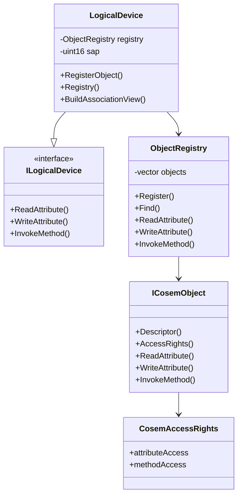
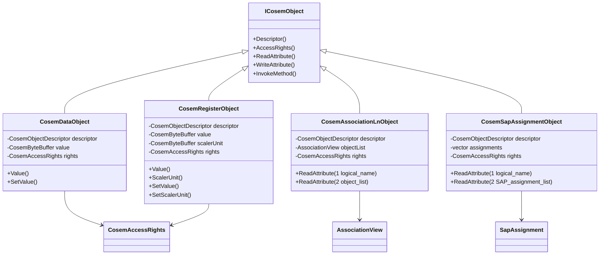

# dlms-cosem API

## 1. Public Headers

Planned phase 1 headers:

```text
include/dlms/cosem/cosem_status.hpp
include/dlms/cosem/cosem_types.hpp
include/dlms/cosem/cosem_object.hpp
include/dlms/cosem/object_registry.hpp
include/dlms/cosem/logical_device_interface.hpp
include/dlms/cosem/logical_device.hpp
include/dlms/cosem/simple_objects.hpp
```

No C ABI is planned for the first implementation.

## 2. Status

`CosemStatus` shall be a stable status contract:

- `Ok`
- `InvalidArgument`
- `DuplicateObject`
- `ObjectNotFound`
- `AttributeNotFound`
- `MethodNotFound`
- `AccessDenied`
- `OutputBufferTooSmall`
- `UnsupportedFeature`
- `ObjectError`
- `InternalError`

## 3. Types

`CosemLogicalName` is a six-byte logical-name value.

`CosemObjectKey` contains:

- `classId`
- `logicalName`

`CosemObjectDescriptor` contains:

- `classId`
- `version`
- `logicalName`

`CosemAttributeDescriptor` contains:

- `object`
- `attributeId`

`CosemMethodDescriptor` contains:

- `object`
- `methodId`

`CosemByteBuffer` is the first-phase encoded xDLMS data container.

## 4. Access Rights

`AttributeAccessMode`:

- `NoAccess`
- `ReadOnly`
- `WriteOnly`
- `ReadAndWrite`
- `AuthenticatedReadOnly`
- `AuthenticatedWriteOnly`
- `AuthenticatedReadAndWrite`

`MethodAccessMode`:

- `NoAccess`
- `Access`
- `AuthenticatedAccess`

`CosemAccessRights` contains attribute and method access entries for one
object. The first implementation stores explicit entries only; missing entries
mean no access.

## 5. Object Interface

```cpp
class ICosemObject
{
public:
  virtual ~ICosemObject();
  virtual CosemObjectDescriptor Descriptor() const = 0;
  virtual CosemAccessRights AccessRights() const = 0;
  virtual CosemStatus ReadAttribute(
    std::uint8_t attributeId,
    CosemByteBuffer& output) const = 0;
  virtual CosemStatus WriteAttribute(
    std::uint8_t attributeId,
    const CosemByteBuffer& input) = 0;
  virtual CosemStatus InvokeMethod(
    std::uint8_t methodId,
    const CosemByteBuffer& input,
    CosemByteBuffer& output) = 0;
};
```

## 6. Registry API

```cpp
ObjectRegistry registry;
registry.Register(object);

const ICosemObject* object = registry.Find(key);
registry.ReadAttribute(attribute, output);
registry.WriteAttribute(attribute, input);
registry.InvokeMethod(method, input, output);
registry.BuildAssociationView(view);
```

## 7. Logical Device Interface

`ILogicalDevice` is the abstract server dispatch boundary for applications
that own their COSEM storage outside the default in-memory `LogicalDevice`:

```cpp
class ILogicalDevice
{
public:
  virtual ~ILogicalDevice();

  virtual CosemStatus ReadAttribute(
    const CosemAttributeDescriptor& descriptor,
    const CosemAccessContext& context,
    CosemByteBuffer& output) const = 0;
  virtual CosemStatus WriteAttribute(
    const CosemAttributeDescriptor& descriptor,
    const CosemAccessContext& context,
    const CosemByteBuffer& input) = 0;
  virtual CosemStatus InvokeMethod(
    const CosemMethodDescriptor& descriptor,
    const CosemAccessContext& context,
    const CosemByteBuffer& input,
    CosemByteBuffer& output) = 0;
};
```

`ILogicalDevice` lives in `logical_device_interface.hpp`. Applications that
only implement custom COSEM storage can include that interface header without
including the default logical/physical device declarations. `LogicalDevice`
lives in `logical_device.hpp`, is the default implementation over
`ObjectRegistry`, and implements `ILogicalDevice`.

## 8. Module Diagram



## 9. Simple Interface Objects

`simple_objects.hpp` adds reusable in-memory implementations for the first
concrete COSEM interface classes:

```cpp
class CosemDataObject : public ICosemObject
{
public:
  static const std::uint8_t MaxSupportedVersion = 0u;

  CosemDataObject(
    const CosemLogicalName& logicalName,
    const CosemByteBuffer& value,
    AttributeAccessMode valueAccess);
  CosemDataObject(
    const CosemLogicalName& logicalName,
    const CosemByteBuffer& value,
    AttributeAccessMode valueAccess,
    std::uint8_t version);

  const CosemByteBuffer& Value() const;
  void SetValue(const CosemByteBuffer& value);
};

class CosemRegisterObject : public ICosemObject
{
public:
  static const std::uint8_t MaxSupportedVersion = 0u;

  CosemRegisterObject(
    const CosemLogicalName& logicalName,
    const CosemByteBuffer& value,
    const CosemByteBuffer& scalerUnit,
    AttributeAccessMode valueAccess);
  CosemRegisterObject(
    const CosemLogicalName& logicalName,
    const CosemByteBuffer& value,
    const CosemByteBuffer& scalerUnit,
    AttributeAccessMode valueAccess,
    std::uint8_t version);

  const CosemByteBuffer& Value() const;
  const CosemByteBuffer& ScalerUnit() const;
  void SetValue(const CosemByteBuffer& value);
  void SetScalerUnit(const CosemByteBuffer& scalerUnit);
};

class CosemClockObject : public ICosemObject
{
public:
  static const std::uint8_t MaxSupportedVersion = 0u;

  CosemClockObject(
    const CosemLogicalName& logicalName,
    const CosemByteBuffer& time,
    std::int16_t timeZone,
    std::uint8_t status,
    const CosemByteBuffer& daylightSavingsBegin,
    const CosemByteBuffer& daylightSavingsEnd,
    std::int8_t daylightSavingsDeviation,
    bool daylightSavingsEnabled,
    CosemClockBase clockBase);
  CosemClockObject(
    const CosemLogicalName& logicalName,
    const CosemByteBuffer& time,
    std::int16_t timeZone,
    std::uint8_t status,
    const CosemByteBuffer& daylightSavingsBegin,
    const CosemByteBuffer& daylightSavingsEnd,
    std::int8_t daylightSavingsDeviation,
    bool daylightSavingsEnabled,
    CosemClockBase clockBase,
    std::uint8_t version);
};
```

The constructors create descriptors with class ids `1`, `3`, and `8`, version `0`.
Each class exposes `MaxSupportedVersion`; constructors that accept `version`
normalize values above the maximum to `MaxSupportedVersion`.
Attribute `1` is read-only logical name. Attribute `2` is the value. Register
attribute `3` is read-only scaler-unit. Methods are not supported in this
increment.

`simple_objects.hpp` also exposes a partial Extended Register IC `4`
(`CosemExtendedRegisterObject`) with class version `0`. The constructors take
the value, scaler-unit, status and capture_time payloads as encoded DLMS Data
octet buffers and accept a caller-selected value access mode. Attribute `1` is
read-only logical name; attribute `2` is the value; attribute `3` is read-only
scaler-unit; attribute `4` is read-only status; attribute `5` is read-only
capture_time (DLMS date-time octet-string). Method `1` `reset` returns
`UnsupportedFeature` (application-defined semantics); other method ids report
`MethodNotFound`.

`simple_objects.hpp` also exposes a partial Demand Register IC `5`
(`CosemDemandRegisterObject`) with class version `0`. The constructors take
the current_average_value, last_average_value, scaler_unit, status,
capture_time and start_time_current payloads as encoded DLMS Data buffers and
accept the `period` (seconds, encoded as DLMS Data `double-long-unsigned`)
and `number_of_periods` (encoded as DLMS Data `long-unsigned`) numeric values.
Attribute `1` is read-only logical name; attributes `2` and `3` are read-only
current/last average values; attribute `4` is read-only scaler-unit;
attribute `5` is read-only status; attribute `6` is read-only capture_time;
attribute `7` is read-only start_time_current; attribute `8` is read-only
period (encoded on read); attribute `9` is read-only number_of_periods
(encoded on read). Methods `1` `reset` and `2` `next_period` return explicit
`UnsupportedFeature` (application-defined semantics); other method ids report
`MethodNotFound`.

`simple_objects.hpp` also exposes a partial Register Activation IC `6`
(`CosemRegisterActivationObject`) with class version `0`. The constructors
take the register_assignment, mask_list and active_mask payloads as encoded
DLMS Data buffers prepared by the caller, plus the logical name and an
optional explicit version that is normalized to `MaxSupportedVersion` when
out of range. Attribute `1` is read-only logical name; attributes `2`, `3`
and `4` are read-only register_assignment, mask_list and active_mask
respectively. Methods `1` `add_register`, `2` `add_mask` and `3`
`delete_mask` mutate caller-owned assignment state and are surfaced as
`UnsupportedFeature`; other method ids report `MethodNotFound`.

`simple_objects.hpp` also exposes a partial Register Monitor IC `21`
(`CosemRegisterMonitorObject`) with class version `0`. The constructors
take the thresholds, monitored_value and actions payloads as encoded DLMS
Data buffers prepared by the caller, the logical name, a caller-selected
`AttributeAccessMode` for `thresholds`, and an optional explicit version
that is normalized to `MaxSupportedVersion` when out of range. Attribute `1`
is read-only logical name; attribute `2` `thresholds` honors the caller
access mode and replaces the stored buffer in-place when writable;
attribute `3` `monitored_value` and attribute `4` `actions` are read-only.
Register Monitor v0 defines no methods, so `InvokeMethod` reports
`MethodNotFound` for every method id.

Clock attribute `2`, `5`, and `6` are DLMS Data `octet-string` values
formatted as 12-byte DLMS date-time octets, as defined by the Clock IC. This is
different from the generic DLMS Data `date-time` tag. Clock methods
`adjust_to_quarter`, `adjust_to_measuring_period`, `adjust_to_minute`,
`adjust_to_preset_time`, `preset_adjusting_time`, and `shift_time` are exposed
in access rights but return `UnsupportedFeature` until a time-adjustment policy
is added.

`simple_objects.hpp` also exposes a partial Profile Generic IC `7` object and
class-level helpers for its current composite attributes:

```cpp
class CosemProfileGenericObject : public ICosemObject
{
public:
  static const std::uint8_t MaxSupportedVersion = 1u;

  CosemProfileGenericObject(
    const CosemLogicalName& logicalName,
    const std::vector<CosemByteBuffer>& bufferRows,
    const std::vector<CosemCaptureObject>& captureObjects,
    std::uint32_t capturePeriod,
    std::uint32_t profileEntries);
  CosemProfileGenericObject(
    const CosemLogicalName& logicalName,
    const std::vector<CosemByteBuffer>& bufferRows,
    const std::vector<CosemCaptureObject>& captureObjects,
    std::uint32_t capturePeriod,
    std::uint32_t profileEntries,
    std::uint8_t version);
};

CosemByteBuffer EncodeProfileGenericCaptureObject(
  const CosemCaptureObject& object);
CosemStatus DecodeProfileGenericCaptureObject(
  const CosemByteBuffer& input,
  CosemCaptureObject& object);
CosemByteBuffer EncodeProfileGenericCaptureObjects(
  const std::vector<CosemCaptureObject>& objects);
CosemStatus DecodeProfileGenericCaptureObjects(
  const CosemByteBuffer& input,
  std::vector<CosemCaptureObject>& objects);
CosemByteBuffer EncodeProfileGenericBuffer(
  const std::vector<CosemByteBuffer>& rows);
CosemStatus DecodeProfileGenericBuffer(
  const CosemByteBuffer& input,
  std::vector<CosemByteBuffer>& rows);
std::uint8_t ProfileGenericRangeAccessSelector();
std::uint8_t ProfileGenericEntryAccessSelector();
CosemByteBuffer EncodeProfileGenericRangeDescriptor(
  const CosemProfileGenericRangeDescriptor& descriptor);
CosemStatus DecodeProfileGenericRangeDescriptor(
  const CosemByteBuffer& input,
  CosemProfileGenericRangeDescriptor& descriptor);
CosemByteBuffer EncodeProfileGenericEntryDescriptor(
  const CosemProfileGenericEntryDescriptor& descriptor);
CosemStatus DecodeProfileGenericEntryDescriptor(
  const CosemByteBuffer& input,
  CosemProfileGenericEntryDescriptor& descriptor);
```

`CosemCaptureObject` follows the Profile Generic
`capture_object_definition` structure order from the knowledge base:
`class_id`, `logical_name`, `attribute_index`, `data_index`. The buffer helpers
encode and decode the top-level `array`; each decoded row is validated as a
DLMS Data `structure` and returned as its original encoded bytes because row
field types are defined by the matching `capture_objects` schema.

Selective access helpers build the `buffer` access parameters documented for
Profile Generic:

- selector `1` uses `CosemProfileGenericRangeDescriptor`, encoded as
  `restricting_object`, `from_value`, `to_value`, and `selected_values`;
- selector `2` uses `CosemProfileGenericEntryDescriptor`, encoded as
  `from_entry`, `to_entry`, `from_selected_value`, and `to_selected_value`.

Range descriptor boundary values are stored as encoded simple DLMS Data bytes.
The decoder validates the allowed simple data tags, including `date-time`,
`date`, and `time`, but keeps the exact encoded value for the caller.

Profile Generic descriptors use class version `1` by default. The explicit
version constructor can publish version `0` when required by a specific meter
model; values above `MaxSupportedVersion` are normalized. Version `0` exposes
legacy methods `3` and `4`, `get_buffer_by_range` and `get_buffer_by_index`,
as `UnsupportedFeature`. Version `1` keeps those method ids unavailable because
the same behavior is represented by selective access.

The same header also adds minimal discovery objects:

```cpp
class CosemAssociationLnObject : public ICosemObject
{
public:
  CosemAssociationLnObject(
    const CosemLogicalName& logicalName,
    const AssociationView& objectList);
};

class CosemSapAssignmentObject : public ICosemObject
{
public:
  static const std::uint8_t MaxSupportedVersion = 0u;

  CosemSapAssignmentObject(
    const CosemLogicalName& logicalName,
    const std::vector<SapAssignment>& assignments);
  CosemSapAssignmentObject(
    const CosemLogicalName& logicalName,
    const std::vector<SapAssignment>& assignments,
    std::uint8_t version);
};

CosemLogicalName CurrentAssociationLnName();
CosemLogicalName SapAssignmentName();
CosemLogicalName LogicalDeviceNameObjectName();
CosemByteBuffer EncodeAssociationAccessRights(
  const CosemAccessRights& rights);
CosemStatus DecodeAssociationAccessRights(
  const CosemByteBuffer& input,
  CosemAccessRights& rights);
CosemByteBuffer EncodeAssociationObjectList(
  const AssociationView& objectList);
CosemStatus DecodeAssociationObjectList(
  const CosemByteBuffer& input,
  AssociationView& objectList);

enum class CosemAssociationStatus
{
  NonAssociated = 0,
  AssociationPending = 1,
  Associated = 2
};

struct CosemAssociationUser
{
  std::uint8_t userId;
  std::string userName;
};

struct CosemAssociationLnConfig
{
  std::uint8_t version;
  CosemAssociationStatus associationStatus;
  bool hasSecuritySetupReference;
  CosemLogicalName securitySetupReference;
  std::vector<CosemAssociationUser> users;
  CosemAssociationUser currentUser;
};
```

Association LN supports caller-selected class versions up to
`CosemAssociationLnObject::MaxSupportedVersion`, currently `3`. Attribute and
method access rights are derived from the selected version: version `0`
exposes attributes `1`, `2`, `8` and methods `1`-`4`; version `1+` may expose
attribute `9`, `security_setup_reference`, when configured; version `2+`
exposes attributes `10`, `11` and methods `5`, `6` for user-list handling.
Unimplemented Association LN methods return `UnsupportedFeature`.

SAP Assignment uses class version `0`; its explicit version constructor
normalizes values above `MaxSupportedVersion`.

Security setup is exposed by `CosemSecuritySetupObject`:

```cpp
class CosemSecuritySetupObject : public ICosemObject
{
public:
  static const std::uint8_t MaxSupportedVersion = 1u;

  CosemSecuritySetupObject(
    const CosemLogicalName& logicalName,
    std::uint8_t securityPolicy,
    std::uint8_t securitySuite,
    const SystemTitle& clientSystemTitle,
    const SystemTitle& serverSystemTitle);
  CosemSecuritySetupObject(
    const CosemLogicalName& logicalName,
    std::uint8_t securityPolicy,
    std::uint8_t securitySuite,
    const SystemTitle& clientSystemTitle,
    const SystemTitle& serverSystemTitle,
    std::uint8_t version);
};
```

The default constructor publishes class version `1`, matching the implemented
attribute and method surface. The explicit version constructors can publish an
older descriptor version when required; values above `MaxSupportedVersion` are
normalized. Version `0` exposes attributes `1` through `5` and methods `1`
and `2`; version `1` also exposes attribute `6`, `certificates`, as a DLMS
Data array of `certificate_info` structures sourced from an attached
`ICosemCertificateStore` (empty array when no entries exist or no store is
attached). Version `1` exposes methods `1` through `8`.
Implemented methods keep their existing runtime behavior: `security_activate`
validates monotonic policy strengthening and `global_key_transfer` supports
suite `0` key transfer through an installed mutable key store. Methods `6`
(`import_certificate`), `7` (`export_certificate`) and `8`
(`remove_certificate`) parse Blue Book payloads (raw octet-string for import;
`structure{enum, structure{...}}` selector for export/remove with `by_entity`
and `by_serial` variants) and dispatch to the certificate store backend.
Without a certificate store attached, methods `6`-`8` return
`UnsupportedFeature` and clear method output. Methods `3` (key agreement),
`4` (generate key pair) and `5` (generate certificate request) remain
`UnsupportedFeature` until an ECDSA / X.509 stack is wired in.

The certificate store contract is declared in
`dlms/cosem/certificate_store.hpp`:

```
struct CertificateInfoEntry {
  std::uint8_t entity;
  std::uint8_t type;
  CertificateSystemTitle systemTitle;
  std::vector<std::uint8_t> serialNumber;
  std::vector<std::uint8_t> issuer;
  std::vector<std::uint8_t> subject;
  std::vector<std::uint8_t> subjectAltName;
  std::vector<std::uint8_t> rawCertificate;
};

class ICosemCertificateStore {
 public:
  virtual CosemStatus List(std::vector<CertificateInfoEntry>& out) const = 0;
  virtual CosemStatus Import(const CertificateInfoEntry& entry) = 0;
  virtual CosemStatus ExportByEntity(std::uint8_t entity,
                                     std::uint8_t type,
                                     const CertificateSystemTitle& systemTitle,
                                     std::vector<std::uint8_t>& raw) const = 0;
  virtual CosemStatus ExportBySerial(const std::vector<std::uint8_t>& serial,
                                     const std::vector<std::uint8_t>& issuer,
                                     std::vector<std::uint8_t>& raw) const = 0;
  virtual CosemStatus RemoveByEntity(std::uint8_t entity,
                                     std::uint8_t type,
                                     const CertificateSystemTitle& systemTitle) = 0;
  virtual CosemStatus RemoveBySerial(const std::vector<std::uint8_t>& serial,
                                     const std::vector<std::uint8_t>& issuer) = 0;
};
```

Lookups that miss return `CosemStatus::ObjectError`. An
`InMemoryCosemCertificateStore` reference backend is provided.

Attribute `8` is `association_status`, encoded as DLMS Data `enum`. Attribute
`9` is encoded as an xDLMS Data octet-string logical name. Attribute `10` is an
array of `{ user_id: unsigned, user_name: visible-string }` structures, and
attribute `11` is one such structure. SAP Assignment exposes read-only
attributes `1` and `2`; its methods are not supported in this increment. Their
list attributes are returned as encoded xDLMS Data array bytes.
Association LN object-list helpers follow the LN `object_list` structure:
`class_id`, `version`, `logical_name`, and `access_rights`. Access rights decode
validates attribute access items, method access items, and the documented
`access_selectors` choice. Selector values are currently validated but not
stored because `CosemAccessRights` models access modes only.


