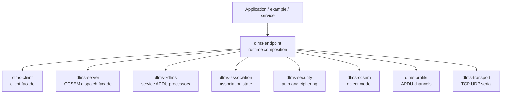
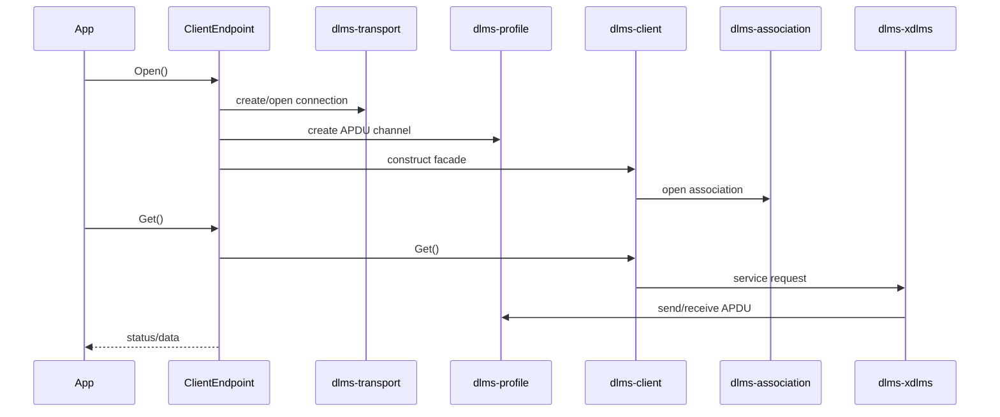
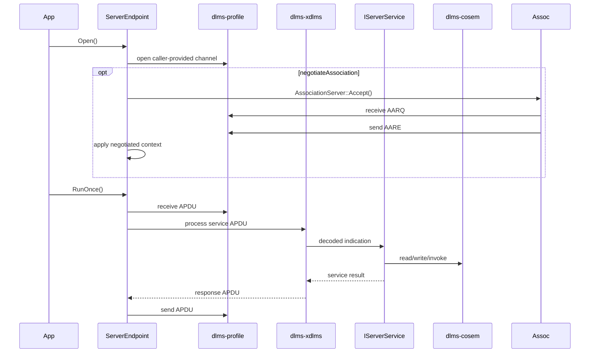
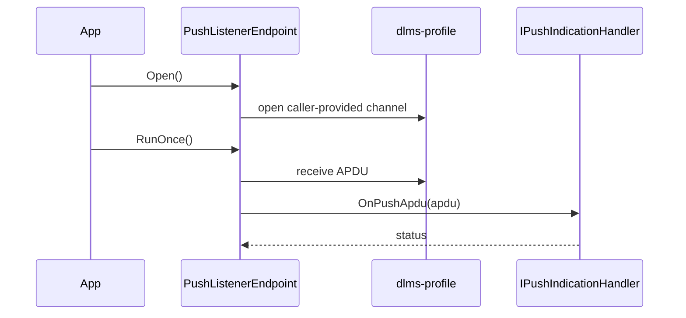
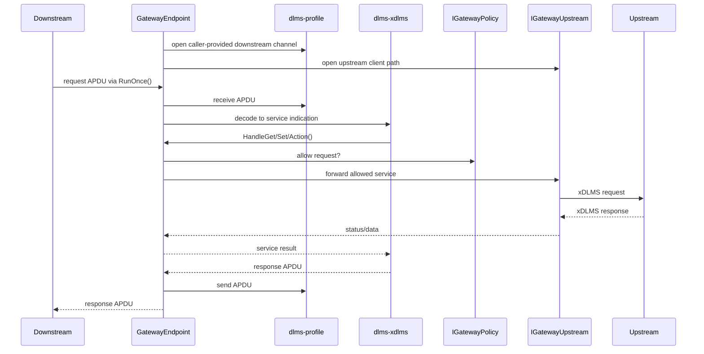
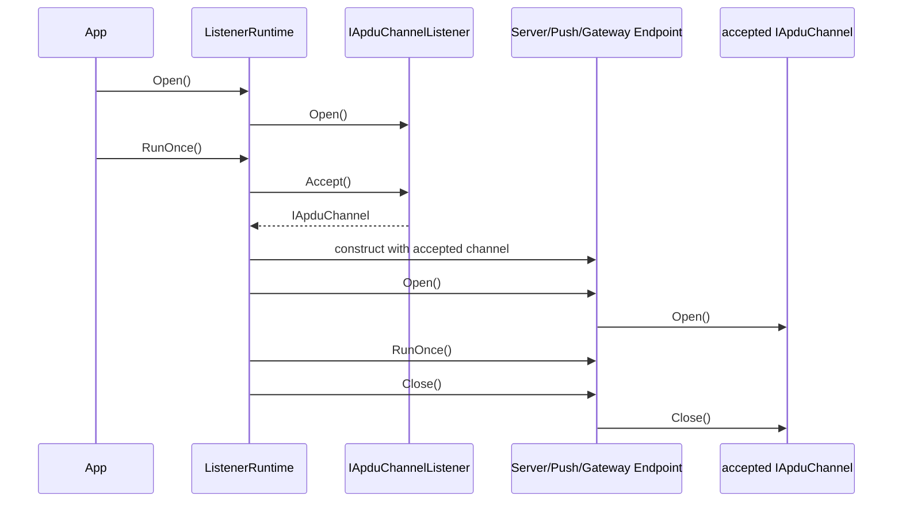
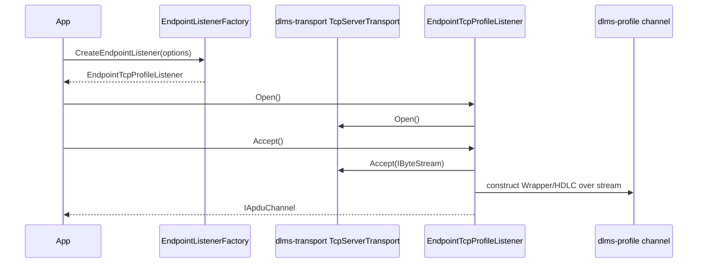
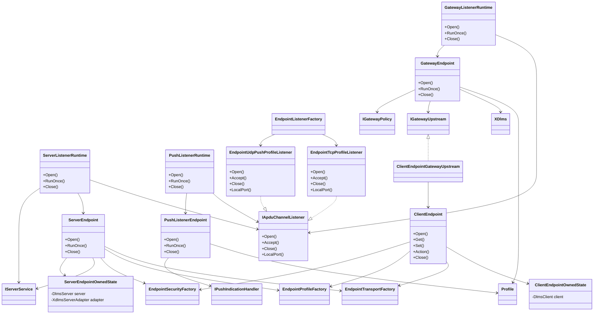
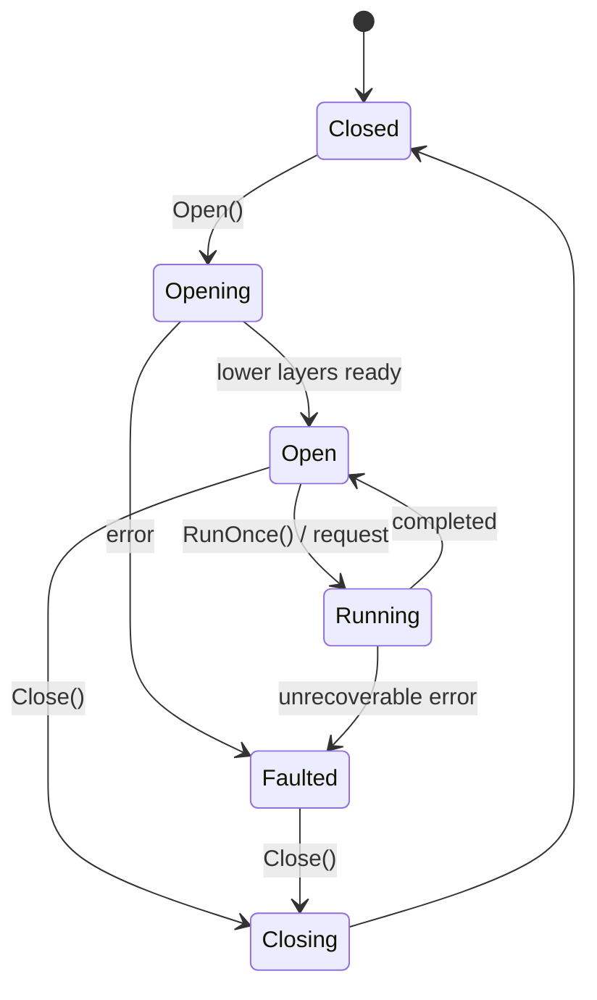

# dlms-endpoint Architecture

## Scope

`dlms-endpoint` is a composition layer. It creates endpoint-level workflows by
connecting lower repositories that already own protocol semantics.

## Layer Boundary

`dlms-endpoint` may know which layers must be connected. It must not duplicate
the implementation owned by those layers.

| Concern | Owning layer |
|---|---|
| TCP, UDP, serial I/O | `dlms-transport` |
| Wrapper and HDLC/LLC APDU channels | `dlms-profile` |
| AARQ, AARE, release, association state | `dlms-association` |
| GET, SET, ACTION APDU services | `dlms-xdlms` |
| HLS, GMAC, ciphered APDU processing | `dlms-security` |
| COSEM objects and access rules | `dlms-cosem` |
| COSEM dispatch over decoded xDLMS indications | `dlms-server` |
| Ergonomic client operations | `dlms-client` |
| Runtime composition and lifecycle | `dlms-endpoint` |

## Client Endpoint Flow

For High GMAC, `ClientEndpoint::Open()` maps endpoint security options into
`dlms-client` HLS GMAC options. If `cipheredApdu` is enabled, HLS pass 3 is
still sent through a plain xDLMS action because the association is not
authenticated until the HLS exchange completes. After that exchange succeeds,
normal GET, SET, and ACTION requests use `dlms-security::CipheredApduProcessor`
through `dlms-xdlms`. A configured `peerSystemTitle` is forwarded as the
client security context's remote/server title; otherwise `dlms-client` uses the
AARE responding application title discovered during HLS GMAC.

## Server Endpoint Flow

When server-side High GMAC is enabled, endpoint creates the HLS strategy used
by `dlms-association::AssociationServer`. The strategy receives the client
system title from the AARQ calling application title before the AARE challenge
is built. If `cipheredApdu` is enabled, `ServerEndpoint` also owns a
`SecurityContext`, key store, invocation counter store, and
`CipheredApduProcessor` for post-HLS service APDUs. The endpoint reserves the
server invocation counters consumed by AARE challenge and HLS server reply so
the first ciphered service response cannot be rejected as replay by the client.
If `peerSystemTitle` is configured, it is installed as the initial remote
system title and may be replaced by the negotiated AARQ title during HLS.
These default server facade, xDLMS adapter, security, and xDLMS processor
objects are private endpoint-owned implementation state; the public
`ServerEndpoint` header exposes the channel and server-service ports without
requiring default server, adapter, or security implementation types.

`ServerEndpoint` can also be constructed with a caller-provided
`dlms::server::IServerService`. In that mode the endpoint still owns channel
lifecycle, optional association negotiation, security processing, and xDLMS
APDU processing, but the decoded service dispatch is delegated to the supplied
server service instead of the default logical-device dispatcher.

## Push Listener Flow

## Gateway Flow

`GatewayEndpoint` keeps the xDLMS server handler, dispatcher, and APDU
processor in private endpoint-owned state. Applications customize gateway
behavior through `IGatewayPolicy` and `IGatewayUpstream`, not by implementing
the xDLMS server handler directly.

## Listener Runtime Flow

Listener runtime classes own only endpoint orchestration. The listener adapter
owns how a profile channel is accepted or constructed. Each `RunOnce()` handles
at most one accepted channel, which keeps tests deterministic and leaves thread
ownership to applications.
`IApduChannelListener::LocalPort()` is part of the listener port so callers can
bind clients to ephemeral listener ports without depending on a TCP or UDP
implementation class.
The listener port lives in its own public header; concrete listener factories
and runtime classes consume that same port without requiring callers to include
both APIs.

`ServerListenerRuntime` supports both default logical-device dispatch and a
caller-provided `dlms::server::IServerService`. The runtime owns only listener
lifecycle and accepted-channel orchestration; service dispatch ownership stays
with the selected server service implementation.

For UDP push listener runtime, `Accept()` means "provide a Wrapper/UDP APDU
channel over the already-open datagram listener" rather than a connection
accept. The UDP listener owns socket lifecycle; the borrowed channel close is a
no-op so the runtime lifecycle remains attached to the listener.

## Listener Factory Flow

The concrete listener adapter does not implement TCP accept or profile
encoding. It maps endpoint options into lower-layer objects and owns the
accepted stream/channel lifetime.

Endpoint factory bundles keep default composition private by exposing only
layer interfaces: `IByteStream`/`IDatagramTransport` for transport,
`IApduChannel` plus optional `IHdlcDataLinkSession` for profile, and
`IApduChannelListener` for listeners. This keeps applications free to replace
any layer implementation with their own object that satisfies the same
abstract port.

For HDLC listener channels, endpoint profile options choose between the default
no-session APDU framing and explicit HDLC data-link setup. With
`hdlcUseSession == true`, the accepted server channel performs the lower-layer
`AcceptDataLink()` handshake when the endpoint opens the channel; the client
side remains responsible for calling `ConnectDataLink()`.

Server-side AARQ/AARE negotiation remains below `dlms-endpoint`. The endpoint
layer may compose `dlms-association::AssociationServer`, but it must not decode
ACSE, negotiate xDLMS context, or synthesize AARE itself. The default endpoint
server/push/gateway runtime path still starts from an already-associated APDU
channel; explicit server, push listener, and gateway downstream association
negotiation is opt-in and currently limited to the no-security LN and
configured Low Password contracts exposed by `dlms-association`.

High Password and High GMAC are also composed through
`dlms-association::AssociationServer` when endpoint negotiation is enabled.
High GMAC authentication and ciphered service APDUs remain separate endpoint
options: authentication selects the ACSE/HLS mechanism, while `cipheredApdu`
selects protected xDLMS service APDUs after association. `systemTitle` denotes
the local endpoint title; `peerSystemTitle` denotes an optional preconfigured
remote endpoint title.

## Class Diagram

## State Model

## Error Model

Endpoint errors are coarse lifecycle results. The originating layer remains
responsible for precise protocol status and trace details.

## Test Strategy

The endpoint repository owns orchestration tests only. Protocol vector tests
remain in lower-layer repositories.
