# dlms-xdlms API

## 1. Public Headers

Public headers:

```text
include/dlms/xdlms/xdlms_status.hpp
include/dlms/xdlms/xdlms_types.hpp
include/dlms/xdlms/xdlms_association_state_interface.hpp
include/dlms/xdlms/xdlms_association_state.hpp
include/dlms/xdlms/xdlms_security_processor_interface.hpp
include/dlms/xdlms/xdlms_security_processor.hpp
include/dlms/xdlms/xdlms_client.hpp
include/dlms/xdlms/xdlms_server.hpp
```

No C ABI is planned for the first implementation.

## 2. Status

`XdlmsStatus` shall be a stable status contract:

- `Ok`
- `InvalidArgument`
- `InvalidState`
- `NotAssociated`
- `SendFailed`
- `ReceiveFailed`
- `EncodeFailed`
- `DecodeFailed`
- `InvokeIdMismatch`
- `ServiceRejected`
- `BlockTransferRequired`
- `UnsupportedFeature`
- `SecurityFailed`
- `InternalError`

## 3. Types

`CosemLogicalName` is a six-byte logical-name value.

`CosemAttributeDescriptor` contains:

- `classId`
- `instanceId`
- `attributeId`

`SelectiveAccessDescriptor` contains:

- `selector`
- `encodedParameters`

`encodedParameters` is a complete encoded DLMS `Data` value. The xDLMS layer
does not interpret Profile Generic selector-specific structures; it validates
that a selector and parameters are present, decodes the parameters as DLMS
`Data`, and emits them into GET-REQUEST-NORMAL selective access.

`ServiceOptions` contains:

- `confirmed`
- `highPriority`
- `allowBlockTransfer`
- `maxBlockTransferBytes`
- `maxGetBlockPayloadBytes`
- `maxSetBlockPayloadBytes`
- `maxActionBlockPayloadBytes`

The default is confirmed normal priority.
Block transfer is enabled by default with a finite maximum collected payload
size.

`GetResult` contains:

- `invokeId`
- `hasData`
- `data`
- `hasAccessResult`
- `accessResult`

The first phase keeps `data` as encoded xDLMS data bytes. Typed COSEM data
projection belongs to later service/facade work.
For GET response block transfer, `data` contains the concatenated raw-data
bytes from all accepted response blocks.

`SetResult` contains:

- `invokeId`
- `accessResult`

`accessResult` is the SET-RESPONSE-NORMAL `Data-Access-Result` value. A value
of `0` represents success.

## 4. Client

```cpp
dlms::xdlms::XdlmsClient client(channel, association);
dlms::xdlms::AssociationClientXdlmsAssociationState associationState(
  association);
dlms::xdlms::XdlmsClient clientViaPort(channel, associationState);
dlms::xdlms::XdlmsClient secureClient(channel, association, security);
dlms::xdlms::CipheredXdlmsSecurityProcessor securityPort(cipheredSecurity);
dlms::xdlms::XdlmsClient secureClientViaPort(
  channel,
  associationState,
  securityPort);

dlms::xdlms::CosemAttributeDescriptor descriptor = {};
descriptor.classId = 1;
descriptor.instanceId = dlms::xdlms::CosemLogicalName(0, 0, 1, 0, 0, 255);
descriptor.attributeId = 2;

dlms::xdlms::GetResult result;
const dlms::xdlms::XdlmsStatus status = client.Get(descriptor, result);
```

GET selective access is available through overloads that accept
`SelectiveAccessDescriptor`:

```cpp
dlms::xdlms::SelectiveAccessDescriptor selection =
  dlms::xdlms::EmptySelectiveAccessDescriptor();
selection.selector = 1;
selection.encodedParameters = {0x00}; // DLMS null-data parameters example

dlms::xdlms::GetResult selectedResult;
const dlms::xdlms::XdlmsStatus selectedStatus =
  client.Get(descriptor, selection, selectedResult);
```

When constructed directly with an `IXdlmsAssociationState&`, `XdlmsClient` does
not own the association-state object. The caller must keep the supplied APDU
channel, association-state object, and optional security processor alive for
the client lifetime.

The preferred association dependency is `IXdlmsAssociationState`, which lets an
embedding application provide its own association layer. Constructors accepting
`dlms::association::IAssociationClient` are available as convenience shortcuts
when the caller already owns an association lifecycle object; applications can
include `dlms/xdlms/xdlms_association_state_interface.hpp` when they implement
only the xDLMS association-state port, or
`dlms/association/association_client_interface.hpp` for the association-client
shortcut contract without including the default concrete association client.
Those shortcuts own a small `AssociationClientXdlmsAssociationState` adapter,
declared in `dlms/xdlms/xdlms_association_state.hpp`, and then use the same
`IXdlmsAssociationState` path internally. The legacy `AssociationClient`
constructors remain available as source-compatible shortcuts over the default
`dlms-association` implementation.

When constructed with an `IXdlmsSecurityProcessor`, the client protects
encoded request APDUs before `SendApdu()` and unprotects received response
APDUs before xDLMS decode. Applications that only implement the abstract
security port can include
`dlms/xdlms/xdlms_security_processor_interface.hpp`.
`CipheredXdlmsSecurityProcessor`, declared in
`dlms/xdlms/xdlms_security_processor.hpp`, adapts the default `dlms-security`
implementation. Existing constructors that accept
`dlms::security::CipheredApduProcessor` remain available as compatibility
shortcuts; internally they adapt the concrete object to the same
`IXdlmsSecurityProcessor` path. The public GET/SET/ACTION service contract does
not otherwise change.

## 5. Server

The server-side boundary accepts decoded xDLMS service models and delegates the
actual COSEM access to an embedding handler:

```cpp
class IXdlmsServerHandler {
public:
  virtual ~IXdlmsServerHandler() = default;

  virtual XdlmsStatus HandleGet(const GetIndication& indication,
                                GetResult& result) = 0;

  virtual XdlmsStatus HandleSet(const SetIndication& indication,
                                SetResult& result);
};
```

`GetIndication` contains:

- `invokeId`
- `options`
- `descriptor`

`SetIndication` contains:

- `invokeId`
- `options`
- `descriptor`
- `data`

`data` carries encoded xDLMS `Data` bytes from SET-REQUEST-NORMAL. The default
`HandleSet` implementation returns `UnsupportedFeature`, allowing existing
GET-only handlers to remain valid until they explicitly support SET.

`IXdlmsServerDispatcher` is the abstract server dispatch port consumed by
`XdlmsServerApduProcessor`. `XdlmsServerDispatcher` is the default
implementation: it validates the indication, calls the handler, and keeps the
response invoke id aligned with the request.

```cpp
dlms::xdlms::XdlmsServerDispatcher dispatcher(handler);

dlms::xdlms::GetIndication indication = {};
indication.invokeId = 1;
indication.descriptor.classId = 1;
indication.descriptor.instanceId = dlms::xdlms::CosemLogicalName(0, 0, 1, 0, 0, 255);
indication.descriptor.attributeId = 2;

dlms::xdlms::GetResult result;
const dlms::xdlms::XdlmsStatus status = dispatcher.DispatchGet(indication, result);
```

```cpp
dlms::xdlms::SetIndication indication = {};
indication.invokeId = 1;
indication.descriptor.classId = 1;
indication.descriptor.instanceId = dlms::xdlms::CosemLogicalName(0, 0, 1, 0, 0, 255);
indication.descriptor.attributeId = 2;
indication.data = {0x12, 0x00, 0x01};

dlms::xdlms::SetResult result;
const dlms::xdlms::XdlmsStatus status = dispatcher.DispatchSet(indication, result);
```

The handler contract is intentionally independent from `dlms-server`; the
server repo can implement an adapter without making `dlms-xdlms` depend on
higher layers.
Applications can also implement `IXdlmsServerDispatcher` directly when they
need custom dispatch validation or routing without using the default
`XdlmsServerDispatcher`.

## 6. Server APDU Boundary

`XdlmsServerApduProcessor` decodes an unprotected xDLMS APDU, dispatches the
GET or SET indication, and encodes the corresponding response:

```cpp
dlms::xdlms::XdlmsServerDispatcher dispatcher(handler);
dlms::xdlms::XdlmsServerApduProcessor processor(dispatcher);
dlms::xdlms::XdlmsServerApduProcessor processorWithOptions(
  dispatcher,
  dlms::xdlms::DefaultServiceOptions());
dlms::xdlms::XdlmsServerApduProcessor secureProcessor(dispatcher, security);
dlms::xdlms::XdlmsServerApduProcessor secureProcessorWithOptions(
  dispatcher,
  security,
  dlms::xdlms::DefaultServiceOptions());
dlms::xdlms::XdlmsServerApduProcessor secureProcessorViaPort(
  dispatcher,
  securityPort);

std::vector<std::uint8_t> response;
const dlms::xdlms::XdlmsStatus status =
  processor.ProcessRequest(requestApdu, response);
```

`ProcessRequest` clears `response` before work starts and writes response bytes
only when encoding succeeds. When constructed with an
`IXdlmsSecurityProcessor`, the processor unprotects the request before xDLMS
decode and protects the encoded response before returning it. Constructors
accepting `dlms::security::CipheredApduProcessor` are retained as
compatibility shortcuts over the default security implementation and are
adapted internally to the `IXdlmsSecurityProcessor` port.
Options-aware constructors set processor-local block transfer limits while
still deriving confirmed/high-priority flags from each incoming invoke id byte.

The processor owns one server-side ACTION request block-transfer state. A
single processor instance is therefore scoped to one association/session when
GET response blocks or ACTION/SET request blocks are enabled.

Supported first APDU shape:

- input: GET-REQUEST-NORMAL, no selective access;
- output: GET-RESPONSE-NORMAL with either data or data-access-result.
- input: GET-REQUEST-NEXT for an active server GET response block sequence;
- output: GET-RESPONSE-WITH-DATABLOCK until the final block is sent.
- input: SET-REQUEST-NORMAL, no selective access;
- output: SET-RESPONSE-NORMAL with data-access-result.
- input: SET-REQUEST-WITH-FIRST-DATABLOCK followed by
  SET-REQUEST-WITH-DATABLOCK for one attribute, no selective access;
- output: SET-RESPONSE-DATABLOCK acknowledgements and
  SET-RESPONSE-LAST-DATABLOCK final access result.

Unsupported first APDU shapes:

- GET-WITH-LIST;
- SET-WITH-LIST;
- SET-WITH-LIST-AND-FIRST-DATABLOCK;
- selective access;
- unsupported ACTION shapes except documented single-method ACTION request
  pblocks;
- ciphered APDUs when the processor was not constructed with a security
  processor;
- ACSE APDUs.

Security failures map to `SecurityFailed`. This includes protection,
unprotection, authentication, replay, missing-key, invalid-key, and invocation
counter failures reported by `dlms-security`.

## 7. Block Transfer

`XdlmsClient::Get()` owns the first client-side block transfer increment. The
method keeps its public signature and consumes `GET-RESPONSE-WITH-DATABLOCK`
responses internally when `ServiceOptions::allowBlockTransfer` is enabled.

Unsupported block-transfer forms still return `BlockTransferRequired`.
Malformed or out-of-order block sequences return `DecodeFailed`.

`XdlmsServerApduProcessor` owns server-side GET response block transfer. A
handler returns complete `GetResult::data`; when the encoded data is larger
than `maxGetBlockPayloadBytes`, the processor emits
`GET-RESPONSE-WITH-DATABLOCK` responses and serves following
`GET-REQUEST-NEXT` requests from processor-local state. Data-access-result
responses remain normal GET responses.

`XdlmsClient::Set()` owns the next client-side block transfer increment. The
default overload keeps the existing signature. An options-aware overload allows
callers to disable block transfer or choose a smaller SET block payload:

```cpp
dlms::xdlms::SetResult result;
dlms::xdlms::ServiceOptions options = dlms::xdlms::DefaultServiceOptions();
options.maxSetBlockPayloadBytes = 128;

const dlms::xdlms::XdlmsStatus status =
  client.Set(descriptor, encodedData, options, result);
```

Blocked SET sends `SET-REQUEST-WITH-FIRST-DATABLOCK` followed by
`SET-REQUEST-WITH-DATABLOCK` requests. The final response is
`SET-RESPONSE-LAST-DATABLOCK`.

`XdlmsClient::Action()` owns ACTION response-side pblock collection. The default
overload keeps the existing signature. The options-aware overload allows callers
to disable block transfer and to select confirmed/high-priority invoke-id
flags:

```cpp
dlms::xdlms::ActionResult result;
dlms::xdlms::ServiceOptions options = dlms::xdlms::DefaultServiceOptions();

const dlms::xdlms::XdlmsStatus status =
  client.Action(descriptor, true, encodedParameter, options, result);
```

ACTION request-side pblock sending is planned next and will use
`maxActionBlockPayloadBytes` for splitting oversized invocation parameters.

## 8. Module Diagram

```mermaid
classDiagram
  class XdlmsClient {
    +Get(CosemAttributeDescriptor, GetResult&) XdlmsStatus
    +Set(CosemAttributeDescriptor, vector~uint8_t~, SetResult&) XdlmsStatus
    +Set(CosemAttributeDescriptor, vector~uint8_t~, ServiceOptions, SetResult&) XdlmsStatus
    +Action(CosemMethodDescriptor, vector~uint8_t~, ActionResult&) XdlmsStatus
    +Action(CosemMethodDescriptor, vector~uint8_t~, ServiceOptions, ActionResult&) XdlmsStatus
  }

  class InvokeIdAllocator {
    +Next() uint8_t
  }

  class BlockTransferManager {
    +AppendBlock() XdlmsStatus
    +Data() vector~uint8_t~
  }

  class SetBlockTransferSender {
    +BuildFirstBlock() XdlmsApdu
    +BuildNextBlock() XdlmsApdu
    +ValidateAck() XdlmsStatus
  }

  class CosemAttributeDescriptor {
    +classId
    +instanceId
    +attributeId
  }

  class GetResult {
    +invokeId
    +data
    +accessResult
  }

  class GetIndication {
    +invokeId
    +options
    +descriptor
  }

  class SetIndication {
    +invokeId
    +options
    +descriptor
    +data
  }

  class IXdlmsServerHandler {
    +HandleGet(GetIndication, GetResult&) XdlmsStatus
    +HandleSet(SetIndication, SetResult&) XdlmsStatus
  }

  class IXdlmsServerDispatcher {
    +DispatchGet(GetIndication, GetResult&) XdlmsStatus
    +DispatchSet(SetIndication, SetResult&) XdlmsStatus
  }

  class XdlmsServerDispatcher {
    +DispatchGet(GetIndication, GetResult&) XdlmsStatus
    +DispatchSet(SetIndication, SetResult&) XdlmsStatus
  }

  class XdlmsServerApduProcessor {
    +ProcessRequest(vector~uint8_t~, vector~uint8_t~&) XdlmsStatus
  }

  class GetResponseBlockState {
    +active
    +invokeId
    +nextBlockNumber
    +offset
    +data
  }

  class IXdlmsSecurityProcessor {
    +Protect(vector~uint8_t~, vector~uint8_t~&) SecurityStatus
    +Unprotect(vector~uint8_t~, vector~uint8_t~&) SecurityStatus
  }

  class CipheredXdlmsSecurityProcessor {
    +Protect(vector~uint8_t~, vector~uint8_t~&) SecurityStatus
    +Unprotect(vector~uint8_t~, vector~uint8_t~&) SecurityStatus
  }

  XdlmsClient --> InvokeIdAllocator
  XdlmsClient --> BlockTransferManager
  XdlmsClient --> SetBlockTransferSender
  XdlmsClient --> CosemAttributeDescriptor
  XdlmsClient --> GetResult
  GetIndication --> ServiceOptions
  GetIndication --> CosemAttributeDescriptor
  SetIndication --> ServiceOptions
  SetIndication --> CosemAttributeDescriptor
  XdlmsServerDispatcher --> IXdlmsServerHandler
  XdlmsServerDispatcher ..|> IXdlmsServerDispatcher
  XdlmsServerDispatcher --> GetIndication
  XdlmsServerDispatcher --> GetResult
  XdlmsServerDispatcher --> SetIndication
  XdlmsServerDispatcher --> SetResult
  XdlmsServerApduProcessor --> IXdlmsServerDispatcher
  XdlmsServerApduProcessor --> GetResponseBlockState
  XdlmsClient --> IXdlmsSecurityProcessor
  XdlmsServerApduProcessor --> IXdlmsSecurityProcessor
  CipheredXdlmsSecurityProcessor --> IXdlmsSecurityProcessor
```



## Diagnostic helpers

This module exposes `xdlms::XdlmsStatusName(s)` for mapping its status enum to a stable,
static-storage C string (`"Ok"`, `"InvalidArgument"`, ...). The full
contract — totality, `"Unknown"` fallback, lifetime, thread-safety,
no-allocation, ABI stability — is documented once in
[`docs/status_to_string_contract.md`](../../../docs/status_to_string_contract.md).

Use the helper for logs, error propagation, and test assertions. Do not
parse the result; it is not a wire format.
